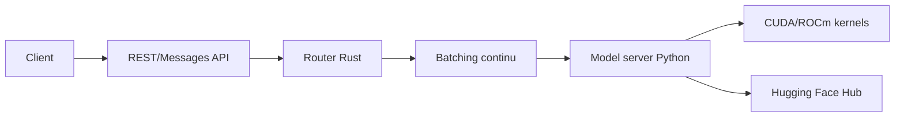

# huggingface/text-generation-inference

> Serveur d'inférence LLM de Hugging Face (Rust/Python/gRPC), désormais archivé en maintenance.

## Le problème
Servir un LLM avec batching continu, streaming, quantification et parallélisme tensoriel demande un moteur dédié.

## Ce que ça fait vraiment
Lance un serveur HTTP (`/generate_stream`, API Messages compatible OpenAI) devant un modèle Hugging Face.
Routeur Rust + serveur Python, parallélisme tensoriel via NCCL, quantification (AWQ, GPTQ, bitsandbytes, fp8…).
Traçage OpenTelemetry, doc OpenAPI sur `/docs`, support GPU NVIDIA et AMD.
Le README annonce le mode maintenance et recommande vLLM, SGLang, llama.cpp ou MLX.

## Comment c'est branché


## Essayer
```bash
model=HuggingFaceH4/zephyr-7b-beta
volume=$PWD/data
docker run --gpus all --shm-size 1g -p 8080:80 -v $volume:/data \
    ghcr.io/huggingface/text-generation-inference:3.3.5 --model-id $model
```

## Coût et pièges
GPU et NVIDIA Container Toolkit requis ; `HF_TOKEN` pour les modèles restreints. Dépôt archivé : plus d'évolutions.

## Ce que ce n'est pas
Plus un choix d'avenir : seules des corrections mineures étaient acceptées avant archivage. Le CPU n'est pas une cible.

## Alternatives
- vllm : recommandé par HF comme successeur pour la prod GPU.
- SGLang : autre moteur recommandé.
- llama.cpp / MLX : pour l'inférence locale.

## Pour toi
À ignorer pour un nouveau projet : archivé, et HF lui-même oriente vers vLLM ou SGLang ; ne le garder que pour maintenir un déploiement existant.
