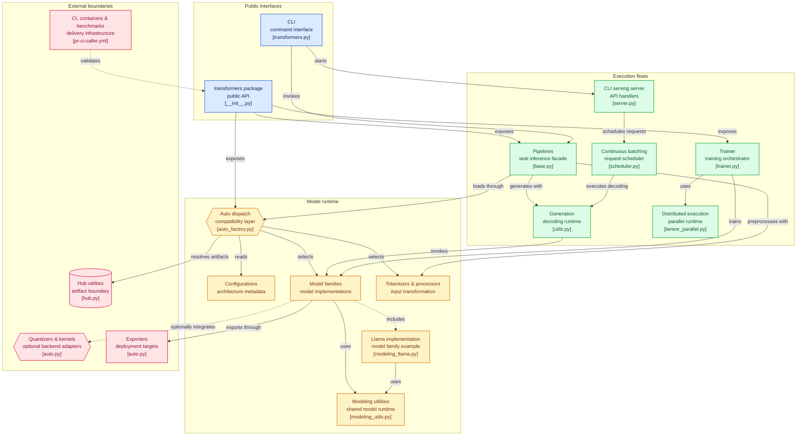

# huggingface/transformers

> **The reference definition of pretrained models in Python: load them, run them, train them.**

## The problem

Without it, every architecture gets reimplemented by hand, and every published set of weights
arrives with its own loading code, its own tokenization, its own generation loop. Nothing
travels from a training framework to an inference engine without being rewritten first.

## What it actually does

Transformers **centralizes the model definition** so that the same definition holds across the
ecosystem. The README calls it the pivot: a model defined here is compatible with most
training frameworks (Axolotl, Unsloth, DeepSpeed, FSDP, PyTorch-Lightning), inference engines
(vLLM, SGLang, TGI) and adjacent modeling libraries (llama.cpp, mlx) that reuse that
definition.

In practice the library ships three things:

1. **an architecture catalog** — hundreds of them, across text, vision, audio, video and
   multimodal — each with its configuration, its PyTorch implementation and its tokenizers or
   modality processors;
2. **a task facade**, the `Pipeline` API, which takes a task (`text-generation`,
   `automatic-speech-recognition`, `image-classification`, `visual-question-answering`…) and a
   model id, downloads and caches the weights, preprocesses the input and returns a
   task-shaped result;
3. **a trainer**, `Trainer`, plus a `transformers` CLI that can chat with a model
   (`transformers chat`) and expose a serving endpoint (`transformers serve`).

The README claims over 1M model checkpoints usable from the Hugging Face Hub. The weights are
not in the repository: they are resolved and downloaded at run time.

## How it is wired



The diagram is derived from the code. The package has two doors — `__init__.py` for the Python
API, `cli/transformers.py` for the CLI — and both converge on the auto-dispatch layer
(`models/auto/auto_factory.py`), which reads a configuration (`configuration_utils.py`),
resolves the artifact on the Hub (`utils/hub.py`), then picks the concrete implementation
(for instance `models/llama/modeling_llama.py`) and the processor (`processing_utils.py`).
Shared utilities (`modeling_utils.py`) own loading, masks, attention and caching for every
family.

Three execution flows start from there: pipelines (`pipelines/base.py`) for task inference;
autoregressive generation (`generation/utils.py`) for decoding — fed by the CLI server
(`cli/serving/server.py`) through a continuous-batching scheduler
(`generation/continuous_batching/scheduler.py`); and training (`trainer.py`) with its
distributed abstractions (`distributed/tensor_parallel.py`). At the edges, quantizers
(`quantizers/auto.py`) and exporters (`exporters/auto.py`) are optional adapters toward
bitsandbytes, AWQ, GGUF, TorchAO, Flash Attention, ONNX or ExecuTorch.

## Try it

```py
# venv
python -m venv .my-env
source .my-env/bin/activate
# uv
uv venv .my-env
source .my-env/bin/activate
```

```py
# pip
pip install "transformers[torch]"

# uv
uv pip install "transformers[torch]"
```

```py
from transformers import pipeline

pipeline = pipeline(task="text-generation", model="Qwen/Qwen2.5-1.5B")
pipeline("the secret to baking a really good cake is ")
```

```shell
transformers chat Qwen/Qwen2.5-0.5B-Instruct
```

Per the README, the chat CLI assumes `transformers serve` is already running.

## Cost and gotchas

The library is Apache-2.0, and installing it needs no key and no account. The required base is
**Python 3.10+ and PyTorch 2.5+**. The real cost sits elsewhere:

- **weights are downloaded**, model by model, from the Hub, and cached on disk — the first
  `pipeline` call is a download, not a computation;
- **model size decides the hardware**. The README puts no number on VRAM, but its chat example
  loads a Llama-3-8B in `bfloat16` with `device_map="auto"`: at that scale an accelerator
  becomes necessary, and the bill is set by the chosen model, not by the library;
- **some weights are gated**: the ids quoted in the README (`meta-llama/…`) go through a Hub
  account, so the material itself depends on a hosted service;
- installing from source is offered, with the README's own warning that the latest version may
  not be stable.

## What it is not

- **Not a turnkey training platform.** The README says so itself: the training API is
  optimized for the PyTorch models Transformers provides, and a generic machine learning loop
  belongs in another library such as Accelerate. The example scripts are *examples*; they may
  not work out of the box on a given use case.
- **Not an inference server.** `transformers serve` exists, but the stated position is that of
  the pivot vLLM, SGLang or TGI consume — not their replacement.
- **Not a modular toolbox of neural-net building blocks.** Model code is deliberately not
  refactored and is duplicated across families, so a researcher can iterate on one file
  without walking through layers of abstraction.
- **The weights are not in the repository.** You clone definition code, not models.

## Alternatives

| | When to prefer it |
|---|---|
| **SYSTRAN/faster-whisper** | For transcription alone, in production, with Whisper already chosen: a specialized reimplementation, narrower and faster on that single job, where Transformers loads Whisper among a thousand other models. |
| **coqui-ai/TTS** | For dedicated speech synthesis, if the need stops at voice; Transformers covers text-to-speech (CSM) but as one modality among many. |

`xorbitsai/inference` and `svc-develop-team/so-vits-svc` are not comparable: the first serves
models, the second does voice conversion. On what Transformers actually is — defining and
loading models for a whole ecosystem — there is **no comparable alternative in the catalog**.
The projects the README names (vLLM, SGLang, TGI, Axolotl, Unsloth, llama.cpp, mlx) consume
that definition rather than substitute for it.

## For you

This is the default dependency for a data/AI profile: the moment a pretrained model enters a
project, it comes through here, and the `Pipeline` API is enough to validate an idea in three
lines. Adopt it without debate, keeping two reflexes: size the model's hardware cost before
the code's, and do not mistake the pivot for the serving engine — under real load it is vLLM
or TGI that pick up the definition.
