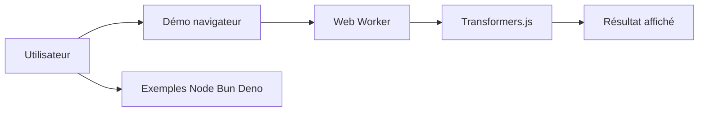

# huggingface/transformers.js-examples

> Collection de démos Transformers.js, du navigateur WebGPU à Node, Bun, Deno et frameworks web.

## Le problème
Savoir comment intégrer l'inférence de modèles dans une page web ou un runtime JS sans serveur Python.

## Ce que ça fait vraiment
Un tableau de projets indépendants : chats LLM WebGPU (Phi-3.5, Llama-3.2, SmolLM), segmentation Segment Anything, retrait d'arrière-plan, recherche sémantique PGlite, embeddings avec Bun et Deno, analyse de sentiment avec Node, Next.js et SvelteKit. D'après le code : pas de runtime commun, chaque exemple est autonome.

## Comment c'est branché

## Essayer
Aucune commande documentée dans le README ; chaque exemple est un sous-dossier, avec un lien de démo et un modèle de départ sur Hugging Face.

## Coût et pièges
Gratuit. WebGPU requis pour les démos de LLM ; les modèles se téléchargent dans le navigateur.

## Ce que ce n'est pas
Pas une bibliothèque : des exemples à copier. Dernier push en février 2026.

## Alternatives
Aucune alternative nommée dans le README.

## Pour toi
À adopter comme référence pour de l'IA côté client : édité par Hugging Face, Apache-2.0, démos prêtes à forker.

