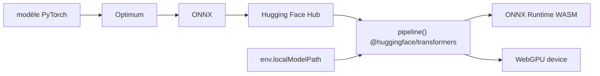

# huggingface/transformers.js

> Exécute des modèles Transformers directement dans le navigateur, sans serveur.

## Le problème
Servir un petit modèle de classification ou d'ASR impose d'héberger une API, de la
payer et d'y faire transiter les données des utilisateurs.

## Ce que ça fait vraiment
Reprend l'API `pipeline` de la bibliothèque Python, fonctionnellement équivalente,
au-dessus d'ONNX Runtime. Couvre le NLP (classification, NER, QA, résumé, traduction,
génération), la vision (classification, détection, segmentation, profondeur,
suppression d'arrière-plan), l'audio (ASR, classification, TTS) et le multimodal
(embeddings, zero-shot image/audio/objets, document QA). Exécution CPU via WASM par
défaut, ou GPU via `device: 'webgpu'`. Quantification choisie par `dtype` :
`fp32`, `fp16`, `q8` (défaut WASM), `q4`. Conversion des modèles PyTorch/TF/JAX en
ONNX avec Optimum.

## Comment c'est branché


## Essayer
```bash
npm i @huggingface/transformers
```

## Coût et pièges
Gratuit. Par défaut les poids sont téléchargés depuis le Hub à chaque visite :
`env.allowRemoteModels = false` et `env.localModelPath` permettent de servir les
modèles soi-même. L'API WebGPU reste expérimentale dans beaucoup de navigateurs.
En environnement contraint, passer en `q8`/`q4` pour la bande passante.

## Ce que ce n'est pas
Pas un portage complet : plusieurs tâches sont explicitement non supportées —
table QA, text-to-image, VQA, génération d'images non conditionnée, classification
et régression tabulaires, audio-to-audio, classification vidéo. Pas d'entraînement.

## Alternatives
- transformers (Python) : la bibliothèque de référence, côté serveur.
- Optimum : la conversion ONNX en amont, pas l'exécution.

## Pour toi
Le bon réflexe pour une démo ou un outil interne où les données ne doivent pas
quitter le poste.
