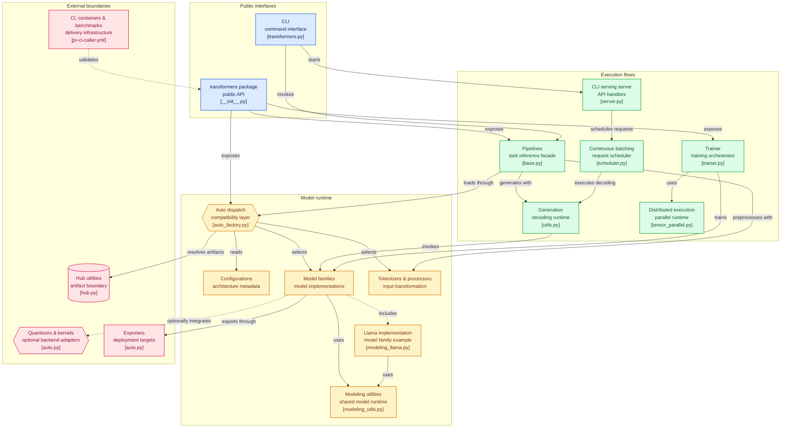

# huggingface/transformers

> **La définition de référence des modèles pré-entraînés en Python, pour les charger, les faire tourner et les entraîner.**

## Le problème

Sans lui, chaque architecture de modèle se réimplémente à la main, et chaque poids publié
arrive avec son propre code de chargement, sa propre tokenisation, sa propre boucle de
génération. Rien ne circule d'un cadre d'entraînement à un moteur d'inférence sans être
réécrit.

## Ce que ça fait vraiment

Transformers **centralise la définition des modèles** pour que cette définition soit la même
dans tout l'écosystème : le README se décrit comme le pivot, et annonce qu'un modèle défini
ici est compatible avec la plupart des cadres d'entraînement (Axolotl, Unsloth, DeepSpeed,
FSDP, PyTorch-Lightning), des moteurs d'inférence (vLLM, SGLang, TGI) et des bibliothèques
voisines (llama.cpp, mlx) qui reprennent cette définition.

Concrètement, la bibliothèque fournit trois choses :

1. **un catalogue d'architectures** — plusieurs centaines, en texte, vision, audio, vidéo et
   multimodal — chacune avec sa configuration, son implémentation PyTorch et ses
   tokeniseurs ou processeurs de modalité ;
2. **une façade de tâche**, l'API `Pipeline`, qui prend une tâche (`text-generation`,
   `automatic-speech-recognition`, `image-classification`, `visual-question-answering`…) et
   un identifiant de modèle, télécharge les poids, les met en cache, prétraite l'entrée et
   rend le résultat dans la forme de la tâche ;
3. **un entraîneur**, `Trainer`, plus une CLI `transformers` qui sait discuter avec un modèle
   (`transformers chat`) et exposer un serveur d'inférence (`transformers serve`).

Le README annonce plus d'un million de points de contrôle utilisables sur le Hugging Face
Hub. Les poids ne sont pas dans le dépôt : ils sont résolus et téléchargés à l'exécution.

## Comment c'est branché



Le diagramme est tiré du code. Le paquet expose deux portes — `__init__.py` pour l'API
Python, `cli/transformers.py` pour la CLI — et tout converge vers la couche de dispatch
automatique (`models/auto/auto_factory.py`), qui lit une configuration
(`configuration_utils.py`), résout l'artefact chez le Hub (`utils/hub.py`) puis choisit
l'implémentation concrète (par exemple `models/llama/modeling_llama.py`) et le processeur
(`processing_utils.py`). Les utilitaires partagés (`modeling_utils.py`) tiennent le
chargement, les masques, l'attention et le cache pour toutes les familles.

Trois flux d'exécution partent de là : les pipelines (`pipelines/base.py`) pour l'inférence
par tâche, la génération autorégressive (`generation/utils.py`) pour le décodage — que le
serveur CLI (`cli/serving/server.py`) alimente via un ordonnanceur de lots continus
(`generation/continuous_batching/scheduler.py`) —, et l'entraînement (`trainer.py`) avec ses
abstractions distribuées (`distributed/tensor_parallel.py`). En bordure, les quantiseurs
(`quantizers/auto.py`) et les exporteurs (`exporters/auto.py`) sont des adaptateurs
optionnels vers bitsandbytes, AWQ, GGUF, TorchAO, Flash Attention, ONNX ou ExecuTorch.

## Essayer

```py
# venv
python -m venv .my-env
source .my-env/bin/activate
# uv
uv venv .my-env
source .my-env/bin/activate
```

```py
# pip
pip install "transformers[torch]"

# uv
uv pip install "transformers[torch]"
```

```py
from transformers import pipeline

pipeline = pipeline(task="text-generation", model="Qwen/Qwen2.5-1.5B")
pipeline("the secret to baking a really good cake is ")
```

```shell
transformers chat Qwen/Qwen2.5-0.5B-Instruct
```

La CLI de chat suppose que `transformers serve` tourne, comme l'indique le README.

## Coût et pièges

La bibliothèque est sous Apache-2.0, sans clé ni compte pour l'installer. Le socle exigé est
**Python 3.10+ et PyTorch 2.5+**. Le vrai coût est ailleurs :

- **les poids se téléchargent**, modèle par modèle, depuis le Hub, et se mettent en cache sur
  le disque — le premier appel d'un `pipeline` est un téléchargement, pas un calcul ;
- **la taille du modèle décide du matériel**. Le README ne chiffre aucun besoin en VRAM, mais
  son exemple de chat charge un Llama-3-8B en `bfloat16` avec `device_map="auto"` : à cette
  échelle, un accélérateur devient nécessaire, et c'est le modèle choisi qui fixe la facture,
  pas la bibliothèque ;
- **certains poids sont sous condition d'accès** : les identifiants cités (`meta-llama/…`)
  passent par un compte Hub, donc une dépendance à un service hébergé pour la matière ;
- l'installation depuis les sources est proposée, avec l'avertissement du README que la
  version la plus récente peut ne pas être stable.

## Ce que ce n'est pas

- **Ce n'est pas une plateforme d'entraînement clé en main.** Le README le dit lui-même :
  l'API d'entraînement est optimisée pour les modèles PyTorch fournis par Transformers, et
  pour une boucle d'apprentissage générique il faut passer par une autre bibliothèque, comme
  Accelerate. Les scripts d'exemple sont des *exemples* : ils ne marchent pas forcément sur
  un cas donné sans adaptation.
- **Ce n'est pas un serveur d'inférence.** `transformers serve` existe, mais le positionnement
  affiché est celui du pivot que vLLM, SGLang ou TGI consomment — pas celui qui les remplace.
- **Ce n'est pas une boîte à outils modulaire de briques de réseaux.** Le code d'un modèle est
  volontairement non refactoré, dupliqué d'une famille à l'autre, pour qu'un chercheur puisse
  itérer sur un fichier sans traverser des couches d'abstraction.
- **Les poids ne sont pas dans le dépôt.** On clone du code de définition, pas des modèles.

## Alternatives

| | Quand le préférer |
|---|---|
| **SYSTRAN/faster-whisper** | Pour de la transcription seule, en production, avec un modèle Whisper déjà choisi : c'est une réimplémentation spécialisée, plus étroite et plus rapide sur cet unique usage, là où Transformers charge Whisper parmi mille autres modèles. |
| **coqui-ai/TTS** | Pour de la synthèse vocale dédiée, si le besoin s'arrête à la voix ; Transformers couvre le texte-vers-parole (CSM) mais comme une modalité parmi d'autres. |

`xorbitsai/inference` et `svc-develop-team/so-vits-svc` ne sont pas comparables : le premier
sert des modèles, le second fait de la conversion de voix. Sur le rôle même de Transformers —
définir et charger des modèles pour tout l'écosystème — **aucune alternative comparable dans
le catalogue**. Les projets que le README cite (vLLM, SGLang, TGI, Axolotl, Unsloth,
llama.cpp, mlx) sont des consommateurs de cette définition, pas des substituts.

## Pour toi

C'est la dépendance par défaut d'un profil data/IA : dès qu'un modèle pré-entraîné entre dans
un projet, c'est par là qu'il passe, et l'API `Pipeline` suffit à valider une idée en trois
lignes. À adopter sans débat, en gardant deux réflexes : mesurer le coût matériel du modèle
avant celui du code, et ne pas confondre le pivot avec le moteur de service — pour de la
charge réelle, c'est vLLM ou TGI qui reprennent la définition.
