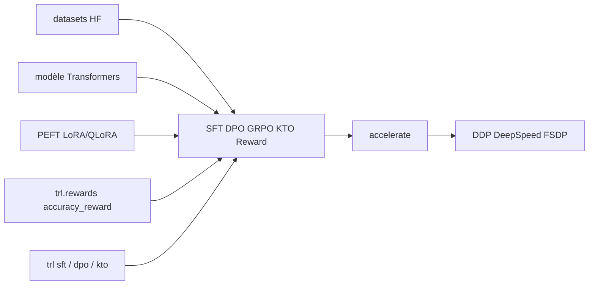

# huggingface/trl

> Bibliothèque de post-entraînement de modèles de fondation : SFT, DPO, GRPO, KTO, reward models.

## Le problème
Aligner un modèle après pré-entraînement demande d'implémenter des boucles RL subtiles et faciles à rater.
Et chaque méthode publiée arrive avec son propre code jetable, incompatible avec l'écosystème Transformers.

## Ce que ça fait vraiment
Expose un entraîneur par méthode : `SFTTrainer`, `DPOTrainer`, `GRPOTrainer`, `KTOTrainer`, `RewardTrainer`.
Chaque entraîneur est une enveloppe légère autour du Trainer de Transformers, avec DDP, DeepSpeed ZeRO et FSDP.
S'appuie sur Accelerate pour passer d'un GPU à un cluster multi-nœuds, et sur PEFT pour LoRA/QLoRA.
Une CLI permet de lancer `trl sft`, `trl dpo`, `trl kto` sans écrire de code.

## Comment c'est branché


## Essayer
```bash
pip install trl
trl sft --model_name_or_path Qwen/Qwen2.5-0.5B --dataset_name trl-lib/Capybara --output_dir Qwen2.5-0.5B-SFT
```
Version de développement : `pip install git+https://github.com/huggingface/trl.git`, puis `pip install -e .[dev]`.

## Coût et pièges
Le post-entraînement suppose du GPU, et d'autant plus de mémoire que le modèle est gros ; PEFT et la
quantification sont la porte de sortie sur matériel modeste. Le guide long contexte va jusqu'à un nœud 8 GPU.

## Ce que ce n'est pas
Pas un cadre d'évaluation : il entraîne, il ne mesure pas la qualité de ce qu'il produit.
Pas un pré-entraînement : le périmètre annoncé est le post-training.
`trl.experimental` n'engage rien : tout y change ou disparaît d'une version à l'autre sans préavis.

## Alternatives
`Unsloth` — intégré, pour accélérer l'entraînement via des noyaux optimisés.
`PEFT` — si tu veux seulement du LoRA sans la couche entraîneurs de TRL.

## Pour toi
La référence si tu dois affiner ou aligner un modèle : commence par `SFTTrainer` sur un 0.5B avant d'y croire.
