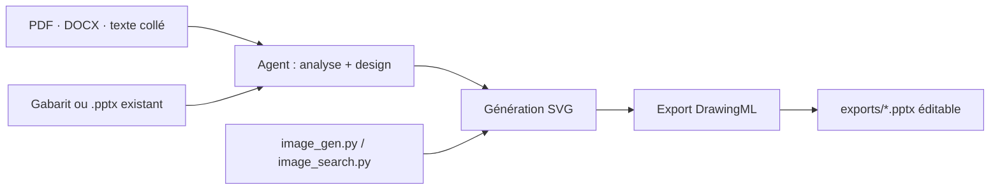

# hugohe3/ppt-master

> Skill qui génère un `.pptx` nativement éditable à partir d'un document source.

## Le problème
Les générateurs de slides par IA livrent des images aplaties ou un pseudo-PowerPoint : impossible de reprendre un élément dans l'outil réel.

## Ce que ça fait vraiment
Un workflow qui tourne dans n'importe quel agent capable de lire, écrire et exécuter : on dit « fais un deck à partir de ce PDF » et il exporte un `.pptx`. Il vise le modèle objet natif de PowerPoint — formes et connecteurs avec poignées d'ajustement, graphiques et tableaux adossés aux données, modèle texte/image/remplissage/effets, masques et dispositions (`p:sldMaster`/`p:sldLayout`). Autres routes : distiller un gabarit depuis une référence, remplir un `.pptx` existant en préservant le design, ajouter transitions, animations et narration. Formules compilées en OMML éditable.

## Comment c'est branché


## Essayer
```bash
git clone https://github.com/hugohe3/ppt-master.git && cd ppt-master
pip install -r requirements.txt
npx skills add hugohe3/ppt-master
python3 skills/ppt-master/scripts/image_gen.py --list-backends
```

## Coût et pièges
Python 3.10+. Le seul coût est ta consommation de modèle, mais elle est réelle : le README recommande un modèle à grand contexte (~1M tokens) et une génération d'images (`gpt-image-2` ou `gemini-3.1-flash-image`). Les clés Pexels/Pixabay sont facultatives. Le convertisseur PDF optionnel dépend de PyMuPDF, en **AGPL-3.0** et non MIT : à vérifier avant toute redistribution.

## Ce que ce n'est pas
Le README le dit franchement : n'attends pas un deck parfait du premier coup ; le modèle fixe le plafond et la finition reste à ta charge. SmartArt est une omission délibérée. Le README met en avant plusieurs sponsors revendeurs d'accès API.

## Alternatives
- cc-switch : bascule de fournisseur d'API entre Claude Code, Codex et Gemini CLI.
- microsoft/ResearchStudio : du papier à la vidéo, au poster et au blog.

## Pour toi
À surveiller : à comparer sérieusement avec ton skill de deck existant avant de changer de chaîne.
