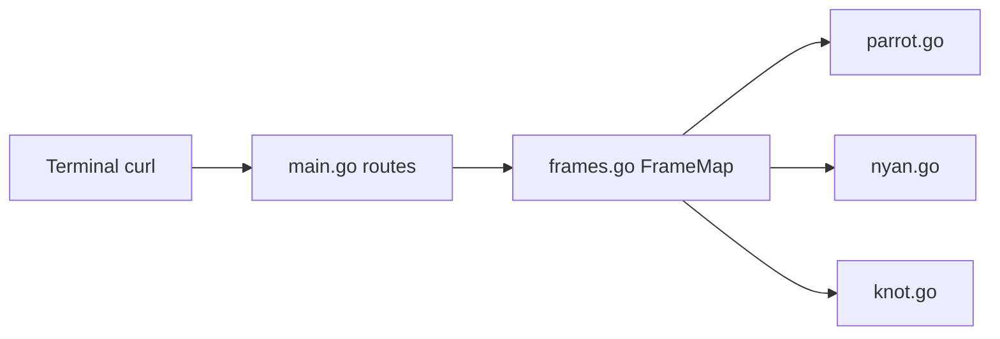

# hugomd/ascii-live

> Serveur Go qui diffuse des animations ASCII en boucle à `curl`, successeur de parrot.live.

## Le problème
Montrer des animations dans un terminal sans rien installer.

## Ce que ça fait vraiment
Un serveur HTTP en Go route une requête vers une animation, vérifie qu'elle existe et que le client est curl, puis diffuse les images en boucle jusqu'à la déconnexion. `/list` donne les noms. Chaque animation est un fichier Go contribué dans `frames/`.

## Comment c'est branché


## Essayer
```bash
curl ascii.live/parrot
go run main.go
docker run -p 8080:8080 hugomd/ascii-live:latest
```

## Coût et pièges
Gratuit. 72 issues ouvertes, dernier push en mai 2025.

## Ce que ce n'est pas
Un divertissement, pas un outil de travail.

## Alternatives
parrot.live, son prédécesseur, et terminal-parrot, cités dans le README.

## Pour toi
À ignorer : curiosité sans utilité pour data, IA ou MLOps.

