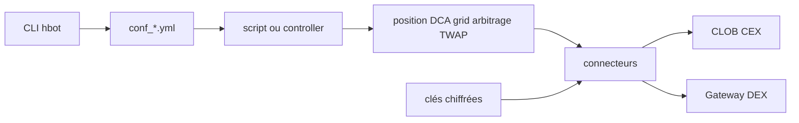

# hummingbot/hummingbot

> Cadre open source pour écrire et exploiter des bots de trading sur places centralisées ou décentralisées.

## Le problème
Brancher une stratégie sur dix places de marché veut dire réécrire dix intégrations REST et WebSocket.
Et tester une stratégie sans risquer d'argent réel demande une simulation qui tienne la route.

## Ce que ça fait vraiment
Normalise les API d'échange derrière des connecteurs classés CLOB CEX, CLOB DEX et AMM DEX.
Offre quatre niveaux d'écriture : scripts d'un fichier, contrôleurs V2 réglables à chaud, exécuteurs, stratégies V1.
La CLI `hbot` pilote un bot de façon non interactive : création de config, démarrage, statut, arrêt, PnL, logs.
Le mode papier `binance_paper_trade` rejoue les données de marché réelles sans clé d'API.

## Comment c'est branché


## Essayer
```bash
git clone https://github.com/hummingbot/hummingbot.git
cd hummingbot
make install
conda activate hummingbot
hbot create simple_pmm --name conf_paper_bot.yml --set exchange=binance_paper_trade --set trading_pair=BTC-USDT
hbot start conf_paper_bot.yml
hbot status
hbot stop
```

## Coût et pièges
Anaconda ou Miniconda requis pour l'installation depuis les sources. Au premier lancement, `hbot` demande
un mot de passe de keystore qui chiffre tes clés d'échange ; en script, il faut `HBOT_PASSWORD` ou `--password-stdin`.

## Ce que ce n'est pas
Pas une stratégie rentable clé en main : ce sont des briques, le risque de marché reste entier.
Pas silencieux : le README renvoie à une page « Reporting » sur la collecte anonyme de données.
Pas multi-bot par installation : le README précise « one bot per install ».

## Alternatives
`Condor` — le harnais IA du même projet, pour des stratégies agentiques pilotées par LLM.
`Hummingbot API` / `Gateway` — dépôts compagnons si tu veux seulement le hub ou le client DEX.

## Pour toi
Hors de ton axe data/IA, sauf curiosité : c'est de l'ingénierie de trading, pas de la modélisation.
