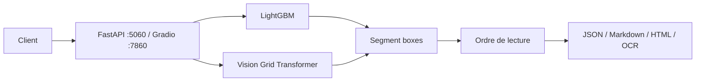

# huridocs/pdf-document-layout-analysis

> Microservice d'analyse de mise en page de PDF : segmentation, OCR, ordre de lecture, export Markdown ou HTML.

## Le problème
Extraire proprement titres, tableaux, formules et figures d'un PDF, dans le bon ordre, est le maillon fragile de tout pipeline de documents.

## Ce que ça fait vraiment
Un service FastAPI et une interface Gradio. Deux modèles : Vision Grid Transformer (précis, GPU conseillé) ou LightGBM (rapide, CPU). Il segmente en 11 catégories DocLayNet, applique un OCR Tesseract (plus de 150 langues), extrait tableaux en HTML et formules en LaTeX, la table des matières, et convertit en Markdown ou HTML, avec traduction via Ollama. Architecture en couches propres (domain, use_cases, adapters, ports).

## Comment c'est branché


## Essayer
```bash
make start
curl -X POST -F 'file=@/path/to/your/document.pdf' http://localhost:5060
curl -X POST -F 'file=@/path/to/your/document.pdf' -F "fast=true" http://localhost:5060
make stop
```

## Coût et pièges
Gratuit ; 2 Go de RAM minimum, 5 Go de mémoire GPU optionnels, 10 Go de disque. VGT tourne à environ 13,5 s par page sur CPU contre 1,75 s sur GPU. La traduction demande un modèle Ollama et un `output_file`.

## Ce que ce n'est pas
Pas un OCR seul ni un LLM : c'est un analyseur de structure. Les langues OCR au-delà des courantes sont à installer dans le conteneur.

## Alternatives
Aucune alternative nommée dans le README.

## Pour toi
À adopter : brique concrète pour préparer des PDF avant un RAG, avec API documentée et choix explicite entre précision et vitesse.
