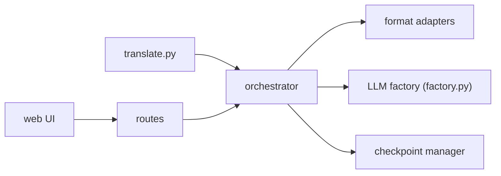

# hydropix/TranslateBooksWithLLMs

> Application de bureau qui traduit livres, sous-titres et documents avec un LLM local ou cloud.

## Le problème
Traduire un roman entier avec un LLM dépasse la fenêtre de contexte et casse la mise en forme (EPUB, SRT).

## Ce que ça fait vraiment
Découpage en morceaux (450 tokens par défaut), traduction par un fournisseur au choix (Ollama, OpenAI, Gemini, Mistral, DeepSeek, OpenRouter, Poe, NIM), réassemblage en conservant balises et minutage. Reprise sur point de contrôle, glossaire et style automatiques, passe d'affinage, synthèse vocale optionnelle. Formats EPUB, SRT, DOCX, TXT ; interface web sur le port 5000.

## Comment c'est branché


## Essayer
```bash
ollama pull qwen3:14b
python translate.py -i book.epub -sl English -tl French
docker build -t translatebook .
```

## Coût et pièges
Gratuit en local avec Ollama (GPU ou beaucoup de RAM selon le modèle) ; sinon clés cloud à ta charge (rotation de plusieurs clés gratuites prévue). Serveur sans comptes : tous les navigateurs partagent l'état. AGPL-3.0.

## Ce que ce n'est pas
Pas une garantie de qualité : elle dépend du modèle et de la langue (un banc d'essai est fourni). Le README affirme une préservation « parfaite » de la mise en forme, non vérifiée ici.

## Alternatives
Aucune alternative nommée dans le README.

## Pour toi
À surveiller : cas concret d'orchestration LLM (découpage, reprise, glossaire) réutilisable ; un modèle local suffit pour l'essayer sans frais.
