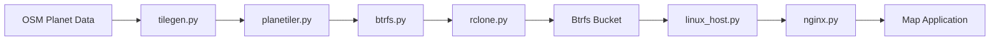

# hyperknot/openfreemap

> Hébergement gratuit de tuiles vectorielles OpenStreetMap, instance publique ou auto-hébergée.

## Le problème
Afficher une carte sur un site oblige à payer un fournisseur de tuiles ou à maintenir un serveur de tuiles délicat.

## Ce que ça fait vraiment
Instance publique sans clé, sans limite, sans cookies, financée par dons.
`tilegen` : planète OSM → Planetiler → MBTiles → image Btrfs compressée → bucket R2 via rclone, chaque semaine.
`linux_host` : télécharge et monte les images Btrfs, sert les tuiles avec nginx, sans serveur de tuiles.
Déploiement Fabric par SSH sur Ubuntu 24.04 ; téléchargements hebdo de la planète.

## Comment c'est branché


## Essayer
```bash
./linux_host/scripts/linux_host.py --help
```

## Coût et pièges
Gratuit ; l'auto-hébergement veut des serveurs dédiés propres. Attribution OSM obligatoire.

## Ce que ce n'est pas
Pas de géocodage, d'itinéraires, de tuiles raster ni d'images satellite. Ne s'installe pas en local et n'a pas de Docker, par choix.

## Alternatives
Aucune alternative nommée (PMTiles cité et écarté pour des raisons de coût cloud).

## Pour toi
À surveiller : fond de carte gratuit idéal pour une démo ou un tableau de bord géo, sous réserve de vérifier la licence et d'accepter la dépendance à un mainteneur unique.
