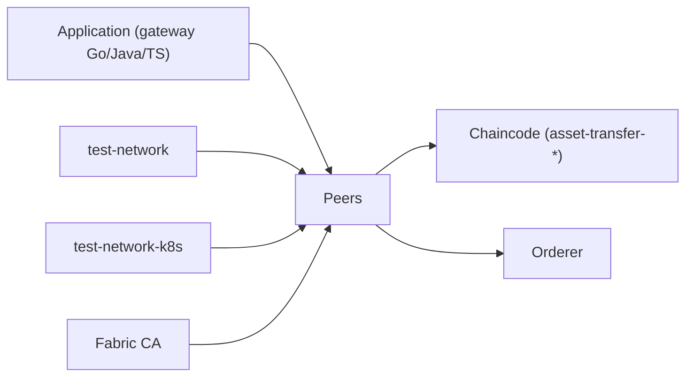

# hyperledger/fabric-samples

> Exemples officiels pour apprendre Hyperledger Fabric : réseau de test, contrats et applications clientes.

## Le problème
Démarrer avec une blockchain permissionnée exige un réseau de test, des contrats et des SDK à assembler.

## Ce que ça fait vraiment
Un réseau de test Docker Compose (deux organisations et un orderer) et une variante Kubernetes. Des séries d'exemples « asset transfer » (basique, requêtes, données privées, endorsement, accord sécurisé, événements, ABAC), des jetons ERC-20, ERC-721, ERC-1155, UTXO, des enchères et un guide full stack. Contrats en Go, JavaScript, TypeScript et Java.

## Comment c'est branché

## Essayer
Le README renvoie à la documentation Fabric pour installer binaires et images Docker ; il ne donne pas de commande shell. Le réseau se lance depuis `test-network` selon son tutoriel.

## Coût et pièges
Gratuit. Il faut Docker et les images Fabric. Les exemples suivent la dernière version ; les anciennes ont leurs branches.

## Ce que ce n'est pas
Pas une base de données ni une solution de production. C'est un support pédagogique.

## Alternatives
Aucune alternative nommée dans le README.

## Pour toi
À ignorer : utile seulement si tu dois évaluer Hyperledger Fabric, hors cœur data/IA/MLOps.

