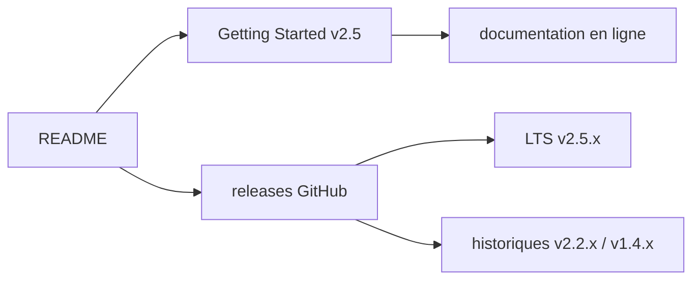

# hyperledger/fabric

> Plateforme de registre distribué à permissions, modulaire, pour consortium d'entreprises.

## Le problème
Partager un registre entre organisations qui ne se font pas confiance sans exposer
toutes les transactions à tout le monde.

## Ce que ça fait vraiment
Le README est court et ne décrit que le cadre : architecture modulaire à
implémentations remplaçables pour chaque composant, orientée confidentialité,
résilience, flexibilité et mise à l'échelle. Projet « Graduated » sous l'ombrelle
Hyperledger. Politique de releases avec support long terme : v2.5.x est la LTS
courante, v2.2.x (fin février 2024) et v1.4.x (fin avril 2021) sont historiques.
Tout le reste — composants, flux de transaction — est renvoyé à la documentation
en ligne « Getting Started with v2.5 ».

## Comment c'est branché

## Essayer
Aucune commande documentée dans ce README : il renvoie entièrement à la section
« Getting Started » de la documentation en ligne.

## Coût et pièges
Gratuit. Le coût est opérationnel : un réseau Fabric suppose plusieurs
organisations, des autorités de certification, des orderers et des pairs à
exploiter. Le README n'en dit rien.

## Ce que ce n'est pas
Ce n'est pas une blockchain publique ni une crypto-monnaie : registre à permissions,
participants connus. Le README seul ne permet pas de juger l'outil — matière
insuffisante, il faut lire la documentation externe pour toute décision.

## Alternatives
- Aucun dépôt alternatif nommé dans le README.

## Pour toi
Aucun rapport avec un usage data / IA / MLOps. À ignorer.
