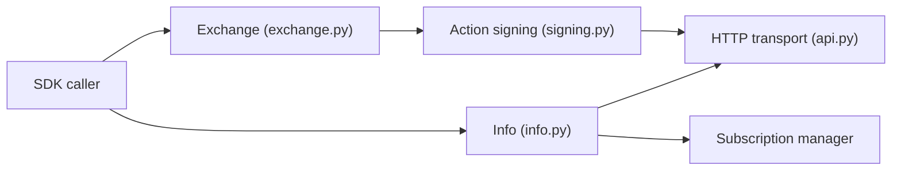

# hyperliquid-dex/hyperliquid-python-sdk

> SDK Python pour lire les données de marché et passer des ordres sur la plateforme Hyperliquid.

## Le problème
Parler à l'API HTTP et WebSocket d'Hyperliquid exige de signer soi-même les actions.

## Ce que ça fait vraiment
- `Info` : état utilisateur, données de marché, abonnements WebSocket.
- `Exchange` : construit, signe et envoie ordres, transferts, staking, coffres.
- Clé privée et adresse lues dans `examples/config.json` ; un portefeuille d'API dédié est possible.

## Comment c'est branché


## Essayer
```bash
pip install hyperliquid-python-sdk
cp examples/config.json.example examples/config.json
python examples/basic_order.py
```

## Coût et pièges
Le SDK est gratuit mais manipule de vraies clés privées : utiliser le testnet d'abord. Dernier push en juin 2026, 102 issues ouvertes.

## Ce que ce n'est pas
Pas un moteur de stratégie ni de backtest ; pas de conseil financier.

## Alternatives
Aucune alternative nommée dans le README.

## Pour toi
À surveiller : pertinent seulement si tu automatises du trading sur Hyperliquid ; attention à la gestion des clés.

