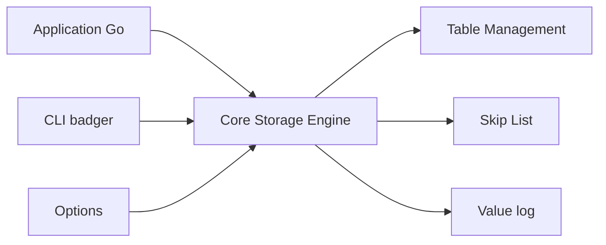

# hypermodeinc/badger

> Base clé-valeur embarquable en Go pur, persistante, avec transactions ACID, pour applications Go.

## Le problème
Un magasin clé-valeur embarqué en Go sans dépendance C (contrairement à RocksDB) et adapté aux SSD.

## Ce que ça fait vraiment
Bibliothèque de stockage LSM avec journal de valeurs, inspirée de l'article WiscKey. Transactions concurrentes ACID en isolation par instantané sérialisable, TTL, snapshots, accès aux versions d'une clé. Le README dit qu'elle est stable et sert des jeux de données de centaines de téraoctets (Dgraph, Jaeger, etc.). Une CLI fait sauvegarde et restauration hors ligne.

## Comment c'est branché


## Essayer
```bash
go get github.com/dgraph-io/badger/v4
```
```bash
cd badger
go install .
```

## Coût et pièges
Go 1.23+. Sur AIX, Windows, Plan9 et WASM, le verrouillage de répertoire et `fsync` diffèrent, avec un risque sur la durabilité (AIX). Vérifier le module de chemin (`dgraph-io/badger/v4`) par rapport au nom du dépôt.

## Ce que ce n'est pas
Pas une base distribuée ni un serveur : c'est une bibliothèque embarquée à intégrer.

## Alternatives
RocksDB (LSM, mais non Go pur), BoltDB (B+ arbre, écritures lentes), LMDB (benchmarks cités).

## Pour toi
À adopter si tu as besoin d'un stockage local clé-valeur transactionnel dans un service Go ; peu utile hors de l'écosystème Go.
