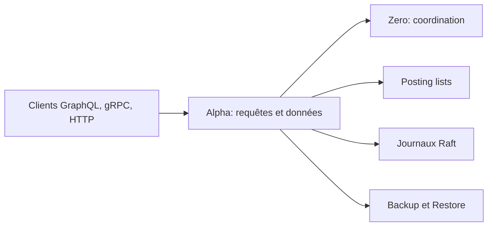

# hypermodeinc/dgraph

> Base de données graphe distribuée avec requêtes de type GraphQL, pour applications à données très reliées.

## Le problème
Plus de dix tables SQL liées par clés étrangères, ou des données creuses, se modélisent et s'interrogent mal en relationnel.

## Ce que ça fait vraiment
Base distribuée et partitionnée, avec transactions ACID, réplication cohérente et lectures linéarisables. Requêtes en langage inspiré de GraphQL, réponses JSON ou Protocol Buffers sur gRPC et HTTP, recherche plein texte, expressions régulières, géo. Écrite en Go. Nœuds Zero (coordination) et Alpha (données, requêtes).

## Comment c'est branché


## Essayer
```bash
docker pull dgraph/dgraph:latest
docker run -it -p 8080:8080 -p 9080:9080 -v ~/dgraph:/dgraph dgraph/standalone:latest
```

## Coût et pièges
Gratuit ; la compilation depuis les sources demande Go 1.27 ou plus. La licence est déclarée Apache 2.0 par le tableau du README mais non déclarée au catalogue : le catalogue fait foi, à vérifier.

## Ce que ce n'est pas
Pas un magasin vectoriel ni une base analytique. La comparaison avec Neo4j et JanusGraph vient du README, donc de l'éditeur.

## Alternatives
- Neo4j : mono-serveur, requêtes Cypher, licence GPL v3 d'après le README.
- JanusGraph : couche sur d'autres bases distribuées, langage Gremlin.

## Pour toi
À ignorer sauf besoin précis de graphe distribué : un profil data/IA rencontre rarement ce cas, et la licence reste à confirmer.
