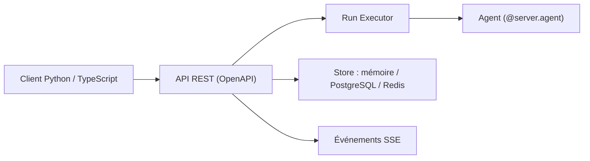

# i-am-bee/acp

> Protocole REST ouvert pour la communication entre agents, désormais fusionné dans A2A.

## Le problème
Les agents construits dans des cadres différents ne se parlent pas.

## Ce que ça fait vraiment
Définit une spécification OpenAPI (agents, runs, sessions, événements SSE) et fournit un SDK Python (serveur et client) plus un client TypeScript. Concepts : manifeste d'agent, run, message et parties multimodales, await, sessions. Stockage en mémoire, PostgreSQL ou Redis. Le README annonce en tête que ACP rejoint A2A sous la Linux Foundation.

## Comment c'est branché


## Essayer
```bash
uv init --python '>=3.11' my_acp_project
cd my_acp_project
uv add acp-sdk
uv run agent.py
curl http://localhost:8000/agents
```

## Coût et pièges
Gratuit, mais dépôt archivé, dernier push en août 2025, et remplacé par A2A. Un guide de migration est indiqué dans le README.

## Ce que ce n'est pas
Ce n'est plus le protocole à adopter : le projet lui-même redirige vers A2A.

## Alternatives
A2A (Linux Foundation), cité comme successeur dans le README.

## Pour toi
À ignorer : archivé et absorbé par A2A ; pars directement sur A2A pour de nouveaux projets.
