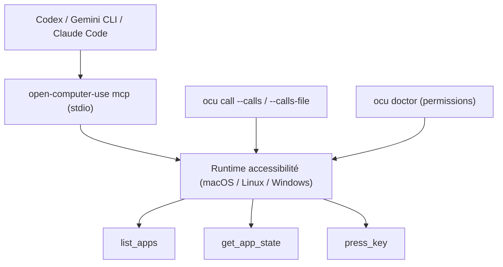

# iFurySt/open-codex-computer-use

> Service Computer Use open source empaqueté en MCP, pour macOS, Linux et Windows.

## Le problème
Piloter l'interface graphique d'une machine depuis un agent suppose en général une pile
propriétaire ou une capture d'écran interprétée à l'aveugle.

## Ce que ça fait vraiment
Expose le Computer Use en serveur MCP : n'importe quel agent ou client MCP peut lister les
applications, lire l'état d'une application, presser des touches, enchaîner des opérations. Le
projet s'inspire du Codex Computer Use d'OpenAI et reprend son principe — un CUA non intrusif
bâti sur les API d'accessibilité plutôt que sur l'injection. Installeurs intégrés pour Codex
(`~/.codex/config.toml`), Claude Code (`~/.claude.json`), Gemini CLI, OpenCode et DeepSeek
Harness. Une skill installable est également publiée. Un sous-projet « Cursor Motion » fournit
un système de mouvement de curseur pour macOS.

## Comment c'est branché


## Essayer
```bash
npm i -g open-computer-use
open-computer-use
open-computer-use install-codex-mcp
open-computer-use install-claude-mcp
open-computer-use call list_apps
open-computer-use call get_app_state --args '{"app":"TextEdit"}'
open-computer-use doctor
npx skills add iFurySt/open-codex-computer-use -g -a claude-code --skill open-computer-use -y
```

## Coût et pièges
Gratuit. Sur macOS il faut macOS 14.0+ et accorder manuellement les permissions
« Accessibilité » et « Enregistrement de l'écran » au premier lancement ; Windows et Linux
n'en ont pas besoin. Donner à un agent le contrôle du clavier et de la souris de ta machine
est un risque en soi : le README ne propose aucun bac à sable.

## Ce que ce n'est pas
Ce n'est pas un agent : c'est l'organe d'exécution. Ce n'est pas non plus du Browser Use — le
README renvoie à `open-browser-use` pour ça. L'auteur précise que le dépôt est issu de son
« harness template » et relève de projets quasi entièrement générés par IA : à lire avant de
lui confier un poste de travail.

## Alternatives
- `open-browser-use`, du même auteur, si le besoin se limite au navigateur.
- Le Codex Computer Use d'OpenAI, cité comme l'inspiration propriétaire.

## Pour toi
Curiosité utile pour automatiser des GUI sans API ; à tenir loin d'une machine qui compte.
