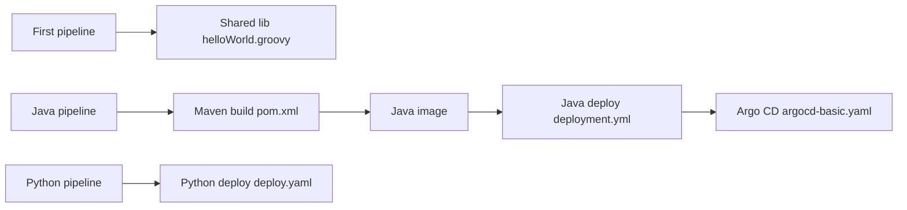

# iam-veeramalla/Jenkins-Zero-To-Hero

> Tutoriel Jenkins : installation sur EC2, agent Docker, pipelines CI/CD vers Kubernetes et Argo CD.

## Le problème
Démarrer avec Jenkins et monter un premier pipeline de bout en bout est confus pour un débutant DevOps.

## Ce que ça fait vraiment
Le README guide l'installation de Java et Jenkins sur Ubuntu/EC2, l'ouverture du port 8080, le plugin Docker Pipeline et les droits Docker.
Le dépôt contient des exemples indépendants : pipelines simples et multi-agents, shared library, app Spring Boot (Maven, Sonar, Helm) et app Django todo.
Manifests Kubernetes et configuration Argo CD pour illustrer le GitOps.

## Comment c'est branché


## Essayer
```bash
sudo apt update
sudo apt install openjdk-17-jre
sudo apt-get install jenkins
sudo apt install docker.io
```

## Coût et pièges
Compte AWS et instance EC2 à ta charge. Le README ouvre « All traffic » en entrée dans son exemple : à restreindre au port 8080. Dernier push mars 2025.

## Ce que ce n'est pas
Pas un produit ni un outil : un support de cours accompagnant des vidéos YouTube. Pas une référence de bonnes pratiques de sécurité.

## Alternatives
Aucune nommée dans le README.

## Pour toi
À ignorer : pédagogique pour débuter en CI Jenkins, mais tes pipelines MLOps se feront plus probablement sur GitHub Actions ou GitLab CI.
