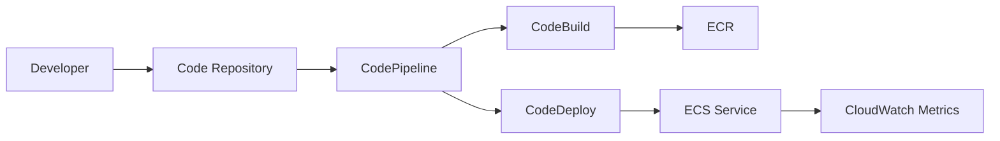

# iam-veeramalla/aws-devops-zero-to-hero

> Cursus de 30 jours pour apprendre AWS côté DevOps, avec projets et questions d'entretien.

## Le problème
AWS compte des centaines de services ; un débutant DevOps ne sait pas dans quel ordre les apprendre ni comment les relier.

## Ce que ça fait vraiment
Un jour par thème : IAM, EC2, VPC, sécurité, Route 53, S3, CLI, CloudFormation, CodeCommit/Pipeline/Build/Deploy, CloudWatch, Lambda, ECR, ECS, EKS, Secrets Manager, Terraform, CloudTrail, ELB, RDS.
Projets pratiques (VPC sécurisé, pipeline CI/CD, déploiement Blue/Green…) et fichiers d'exemple par dossier `day-N`.
Liste de questions d'entretien AWS.
Accompagné d'une playlist YouTube.

## Comment c'est branché

## Essayer
Aucune commande dans le README : c'est un plan de cours.

## Coût et pièges
Compte AWS nécessaire ; les projets (NAT gateway, EKS, RDS) peuvent générer une facture si les ressources ne sont pas détruites.

## Ce que ce n'est pas
Pas un outil ni un template d'infra réutilisable.
Contenu non mis à jour depuis mi-2025 ; le jour 23 annonce Systems Manager mais traite Secrets Manager.

## Alternatives
Aucune alternative nommée dans le README.

## Pour toi
À ignorer sauf besoin de formation AWS de base : aucun contenu spécifique ML, et SageMaker n'est pas abordé.
