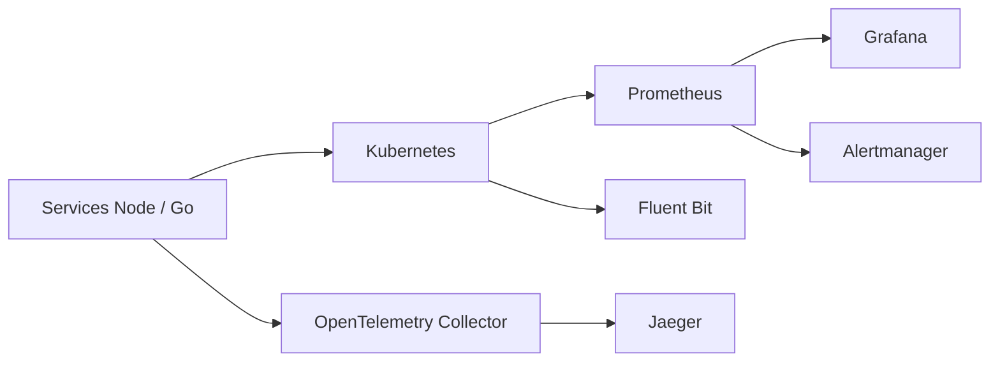

# iam-veeramalla/observability-zero-to-hero

> Tutoriel en sept jours sur l'observabilité de Kubernetes : Prometheus, Grafana, EFK, Jaeger, OpenTelemetry.

## Le problème
Apprendre métriques, logs et traces sur Kubernetes sans trouver de parcours pratique qui relie les outils.

## Ce que ça fait vraiment
Sept dossiers `day-*` : intro, Prometheus + Grafana (kube-prometheus-stack via Helm, sur EKS), PromQL, métriques personnalisées avec `prom-client` (services Node `service-a`/`service-b`) et Alertmanager, logs avec Fluent Bit (variante OpenSearch), traces Jaeger, puis OpenTelemetry Collector avec deux microservices Go. Chaque jour est un module quasi indépendant, avec manifestes et valeurs Helm.

## Comment c'est branché

## Essayer
Le README ne donne pas de commande : il décrit le contenu de chaque jour. Les commandes sont dans les dossiers `day-*` (non lus ici).

## Coût et pièges
Un cluster Kubernetes (EKS dans les exemples) est nécessaire et peut être facturé. Aucune licence déclarée. Le README de Jour 5 est tronqué.

## Ce que ce n'est pas
Pas un outil ni un produit : un support de cours. Ne traite pas l'observabilité spécifique aux modèles ou LLM.

## Alternatives
Non documenté dans le README.

## Pour toi
Surveiller : bon parcours pour la couche observabilité d'un profil MLOps, si tu as déjà un cluster de test ; sans licence, ne pas reprendre le contenu tel quel.
