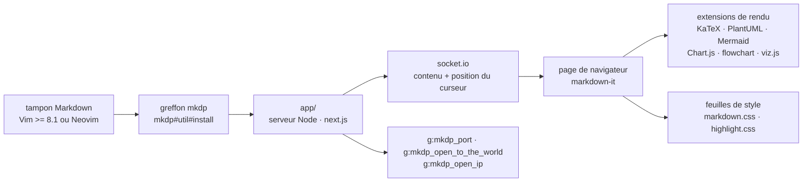

# iamcco/markdown-preview.nvim

> **A (Neo)vim plugin that renders the current Markdown buffer in a browser, with synchronised scrolling.**

## The problem

Writing Markdown in Vim tells you nothing about how it will look once rendered: formulas,
tables, diagrams and local images can only be checked afterwards, in another tool. So you
switch between the editor and a rendering you must refresh by hand, and you lose your place in
the document on every round trip.

## What it actually does

The plugin starts a local server and opens a browser page that follows the current buffer. The
README claims three properties: cross platform (macOS, Linux, Windows), synchronised
scrolling, and asynchronous updates. Vim's cursor drives the page; the synchronisation mode is
set through `sync_scroll_type` (`middle`, `top` or `relative`), or turned off through
`disable_sync_scroll`.

Rendering is markdown-it plus the extensions listed in the README: KaTeX for maths, PlantUML,
Mermaid, Chart.js, js-sequence-diagrams, Flowchart, dot (viz.js), table of contents, emojis,
task lists, local images. Each is configured through a key of `g:mkdp_preview_options`. The
README states that the `mathjax-support-for-mkdp` plugin is no longer needed for maths.

The rest is configuration: open automatically when entering a Markdown buffer
(`g:mkdp_auto_start`), close automatically (`g:mkdp_auto_close`), refresh only on save
(`g:mkdp_refresh_slow`), extend the command to every filetype (`g:mkdp_command_for_global`),
custom stylesheets (`g:mkdp_markdown_css`, `g:mkdp_highlight_css`), fixed or random port
(`g:mkdp_port`), page title, dark or light theme, custom browser or custom Vim function to
open the page. Only three commands: `:MarkdownPreview`, `:MarkdownPreviewStop`, plus the
`MarkdownPreviewToggle` switch, with matching `<Plug>` mappings.

Two options concern network access: `g:mkdp_open_to_the_world` exposes the server to the local
network instead of `127.0.0.1`, and `g:mkdp_open_ip` covers the case of a remote Vim with a
local browser.

## How it is wired



No code-derived diagram exists for this repository: this one is reconstructed from the README
alone. The only file names the README gives are `app/` (the Node sub-project, built with
`yarn install` then `yarn build`) and the install function `mkdp#util#install()`, which
downloads a pre-built binary when you have neither Node nor yarn. Vim support (as opposed to
Neovim) goes through `@chemzqm/neovim`, and browser communication through socket.io, both
listed in the references.

## Trying it

With vim-plug, two routes depending on whether you have Node:

```vim
" If you don't have nodejs and yarn
" use pre build, add 'vim-plug' to the filetype list so vim-plug can update this plugin
" see: https://github.com/iamcco/markdown-preview.nvim/issues/50
Plug 'iamcco/markdown-preview.nvim', { 'do': { -> mkdp#util#install() }, 'for': ['markdown', 'vim-plug']}


" If you have nodejs
Plug 'iamcco/markdown-preview.nvim', { 'do': 'cd app && npx --yes yarn install' }
```

With lazy.nvim:

```lua
-- install without yarn or npm
{
    "iamcco/markdown-preview.nvim",
    cmd = { "MarkdownPreviewToggle", "MarkdownPreview", "MarkdownPreviewStop" },
    ft = { "markdown" },
    build = function() vim.fn["mkdp#util#install"]() end,
}
```

By hand:

```vim
cd ~/.local/share/nvim/site/pack/packer/start/
git clone https://github.com/iamcco/markdown-preview.nvim.git
cd markdown-preview.nvim
npx --yes yarn install
npx --yes yarn build
```

Then, from a Markdown buffer:

```vim
" Start the preview
:MarkdownPreview

" Stop the preview"
:MarkdownPreviewStop
```

The README also gives recipes for dein, minpac, Vundle and Packer.

## Cost and traps

- **Editor version**: the README says so up front, "It only works on Vim >= 8.1 and Neovim".
- **Node and yarn, or the pre-built binary**: the full route needs `node.js` and `yarn`
  installed plus a build step (`yarn install` then `yarn build`). Without them,
  `mkdp#util#install()` fetches a pre-built version — a downloaded binary you did not build
  yourself.
- **Laggy scrolling**: the FAQ points to `set updatetime=100`. The Vim setting is the cause,
  not the plugin.
- **WSL 2**: the FAQ notes that the browser will not open from a terminal Vim under WSL 2; on
  Ubuntu, `sudo apt-get install -y xdg-utils` is the stated workaround.
- **Local HTTP server**: bound to `127.0.0.1` by default, but `g:mkdp_open_to_the_world` makes
  it reachable from the network. Do not enable it without knowing what you are publishing.
- **PlantUML**: the README documents no local PlantUML install, only the block syntax and the
  `uml` options; how rendering is obtained is not documented.
- **The line `let g:mkdp_images_path = /home/user/.markdown_images`**: the value is unquoted in
  the README, so fix it if you copy it.

## What it is not

- **It is not in-editor rendering.** The preview shows in an external browser: with no browser
  reachable from the machine running Vim (remote server, bare terminal, misconfigured WSL 2),
  there is nothing to look at. The `g:mkdp_open_ip` and `g:mkdp_browserfunc` options exist for
  exactly those cases.
- **It is not a converter or exporter.** No HTML or PDF export command is documented; the
  plugin serves a page, it does not produce a file. The preview page's `content_editable` is an
  in-browser editing option, not a publishing mechanism.
- **It is not GitHub-faithful rendering.** The pipeline is markdown-it plus a chosen set of
  extensions, with the same author's `markdown.css`: what you see is what this plugin renders,
  not what another platform will render.
- **It is not a JavaScript-free plugin**: even on the pre-built route, a Node server runs in
  the background while the preview is open.

## Alternatives

No comparable alternative in the catalogue: the batch line proposes no neighbours for this
repository, and the README names no competing preview plugin. The projects it cites are its own
building blocks (markdown-it, KaTeX, Mermaid, Chart.js, socket.io, next.js) or its Vim support
sources (`coc.nvim`, `@chemzqm/neovim`), not substitutes. The one plugin it names,
`mathjax-support-for-mkdp`, is explicitly declared unnecessary.

## For you

Useful if you write technical notes in Neovim and those notes contain KaTeX formulas, Mermaid
diagrams or Chart.js charts — exactly the material of an experiment log or an architecture
note. Synchronised scrolling is what makes the difference on a long document. Skip it if you
write your Markdown outside Vim, or if your working machine has no browser at hand: everything
else in the plugin assumes those two things.
