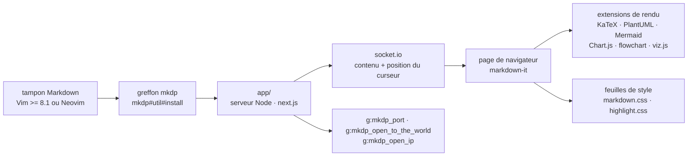

# iamcco/markdown-preview.nvim

> **Greffon (Neo)vim qui affiche le Markdown de l'éditeur dans le navigateur, défilement synchronisé compris.**

## Le problème

Écrire du Markdown dans Vim ne dit rien de ce qu'il donnera une fois rendu : formules, tables,
diagrammes et images locales ne se vérifient qu'après coup, dans un autre outil. On alterne
donc entre l'éditeur et un rendu qu'il faut rafraîchir à la main, et on perd la position du
curseur à chaque aller-retour.

## Ce que ça fait vraiment

Le greffon démarre un serveur local et ouvre une page de navigateur qui suit le tampon en
cours. Le README annonce trois propriétés : multiplateforme (macOS, Linux, Windows),
défilement synchronisé, et mises à jour asynchrones. Le curseur de Vim pilote la page ; le
mode de synchronisation se règle par `sync_scroll_type` (`middle`, `top` ou `relative`), ou se
coupe par `disable_sync_scroll`.

Le rendu est celui de markdown-it augmenté d'extensions listées dans le README : KaTeX pour
les mathématiques, PlantUML, Mermaid, Chart.js, js-sequence-diagrams, Flowchart, dot (viz.js),
table des matières, emojis, listes de tâches, images locales. Chacune se pilote par une clé de
`g:mkdp_preview_options`. Le README précise que le greffon `mathjax-support-for-mkdp` n'est
plus nécessaire pour les mathématiques.

Le reste est de la configuration : ouverture automatique à l'entrée dans un tampon Markdown
(`g:mkdp_auto_start`), fermeture automatique (`g:mkdp_auto_close`), rafraîchissement seulement
à la sauvegarde (`g:mkdp_refresh_slow`), commande étendue à tous les types de fichiers
(`g:mkdp_command_for_global`), feuilles de style CSS personnalisées (`g:mkdp_markdown_css`,
`g:mkdp_highlight_css`), port fixe ou aléatoire (`g:mkdp_port`), titre de page, thème sombre ou
clair, navigateur ou fonction Vim d'ouverture personnalisés. Trois commandes seulement :
`:MarkdownPreview`, `:MarkdownPreviewStop`, plus la bascule `MarkdownPreviewToggle`, avec les
mappings `<Plug>` correspondants.

Deux options concernent l'accès réseau : `g:mkdp_open_to_the_world` expose le serveur au
réseau local au lieu de `127.0.0.1`, et `g:mkdp_open_ip` sert le cas d'un Vim distant avec le
navigateur en local.

## Comment c'est branché



Aucun diagramme tiré du code n'existe pour ce dépôt : ce schéma est reconstruit depuis le seul
README. Les seuls noms de fichiers que le README donne sont `app/` (le sous-projet Node,
construit par `yarn install` puis `yarn build`) et la fonction d'installation
`mkdp#util#install()`, qui télécharge un binaire pré-compilé quand on n'a ni Node ni yarn. Le
support de Vim (par opposition à Neovim) passe par `@chemzqm/neovim`, et la communication
navigateur par socket.io, tous deux cités en références.

## Essayer

Avec vim-plug, deux voies selon qu'on a Node ou non :

```vim
" If you don't have nodejs and yarn
" use pre build, add 'vim-plug' to the filetype list so vim-plug can update this plugin
" see: https://github.com/iamcco/markdown-preview.nvim/issues/50
Plug 'iamcco/markdown-preview.nvim', { 'do': { -> mkdp#util#install() }, 'for': ['markdown', 'vim-plug']}


" If you have nodejs
Plug 'iamcco/markdown-preview.nvim', { 'do': 'cd app && npx --yes yarn install' }
```

Avec lazy.nvim :

```lua
-- install without yarn or npm
{
    "iamcco/markdown-preview.nvim",
    cmd = { "MarkdownPreviewToggle", "MarkdownPreview", "MarkdownPreviewStop" },
    ft = { "markdown" },
    build = function() vim.fn["mkdp#util#install"]() end,
}
```

À la main :

```vim
cd ~/.local/share/nvim/site/pack/packer/start/
git clone https://github.com/iamcco/markdown-preview.nvim.git
cd markdown-preview.nvim
npx --yes yarn install
npx --yes yarn build
```

Puis, dans un tampon Markdown :

```vim
" Start the preview
:MarkdownPreview

" Stop the preview"
:MarkdownPreviewStop
```

Le README donne aussi les recettes dein, minpac, Vundle et Packer.

## Coût et pièges

- **Version d'éditeur** : le README l'écrit d'emblée, « It only works on Vim >= 8.1 and Neovim ».
- **Node et yarn, ou le binaire pré-compilé** : la voie complète demande `node.js` et `yarn`
  installés et une étape de construction (`yarn install` puis `yarn build`). Sans eux,
  `mkdp#util#install()` récupère une version pré-compilée — donc un binaire téléchargé qu'on
  n'a pas construit soi-même.
- **Défilement qui traîne** : la FAQ renvoie au réglage `set updatetime=100`. C'est le réglage
  de Vim qui est en cause, pas le greffon.
- **WSL 2** : la FAQ signale que le navigateur ne s'ouvre pas depuis un Vim en terminal sous
  WSL 2 ; sur Ubuntu, `sudo apt-get install -y xdg-utils` est la contournement indiqué.
- **Serveur HTTP local** : par défaut sur `127.0.0.1`, mais `g:mkdp_open_to_the_world` le rend
  accessible au réseau. À ne pas activer sans savoir ce qu'on publie.
- **PlantUML** : le README ne documente pas d'installation locale de PlantUML, seulement la
  syntaxe de bloc et les options `uml` ; comment le rendu est obtenu n'est pas documenté.
- **Documentation en `let g:mkdp_images_path = /home/user/.markdown_images`** : la valeur
  n'est pas entre guillemets dans le README, à corriger en la recopiant.

## Ce que ce n'est pas

- **Ce n'est pas un rendu dans Vim.** L'aperçu s'affiche dans un navigateur externe : sans
  navigateur accessible depuis la machine où tourne Vim (serveur distant, terminal nu,
  WSL 2 mal configuré), il n'y a rien à voir. Les options `g:mkdp_open_ip` et
  `g:mkdp_browserfunc` existent précisément pour ces cas.
- **Ce n'est pas un convertisseur ni un exportateur.** Aucune commande d'export vers HTML ou
  PDF n'est documentée ; le greffon sert une page, il ne produit pas de fichier. Le
  `content_editable` de la page d'aperçu est une option d'édition dans le navigateur, pas un
  mécanisme de publication.
- **Ce n'est pas un rendu conforme à GitHub.** Le pipeline est markdown-it plus des extensions
  choisies, avec `markdown.css` du même auteur : ce qui s'affiche est ce que ce greffon rend,
  pas ce que rendra une autre plateforme.
- **Ce n'est pas un greffon sans dépendance JavaScript** : même par la voie pré-compilée, un
  serveur Node tourne en arrière-plan pendant l'aperçu.

## Alternatives

Aucune alternative comparable dans le catalogue : la ligne du lot ne propose aucun voisin pour
ce dépôt, et le README ne nomme aucun greffon d'aperçu concurrent. Les projets qu'il cite sont
ses propres briques (markdown-it, KaTeX, Mermaid, Chart.js, socket.io, next.js) ou ses sources
de support Vim (`coc.nvim`, `@chemzqm/neovim`), pas des substituts. Le seul greffon nommé,
`mathjax-support-for-mkdp`, est explicitement déclaré inutile.

## Pour toi

Utile si tu rédiges des notes techniques dans Neovim et que ces notes contiennent des formules
KaTeX, des diagrammes Mermaid ou des graphiques Chart.js — exactement la matière d'un carnet
d'expériences ou d'une note d'architecture. Le défilement synchronisé fait la différence sur un
document long. À passer si tu écris ton Markdown ailleurs que dans Vim, ou si ta machine de
travail n'a pas de navigateur sous la main : tout le reste du greffon suppose ces deux choses.
