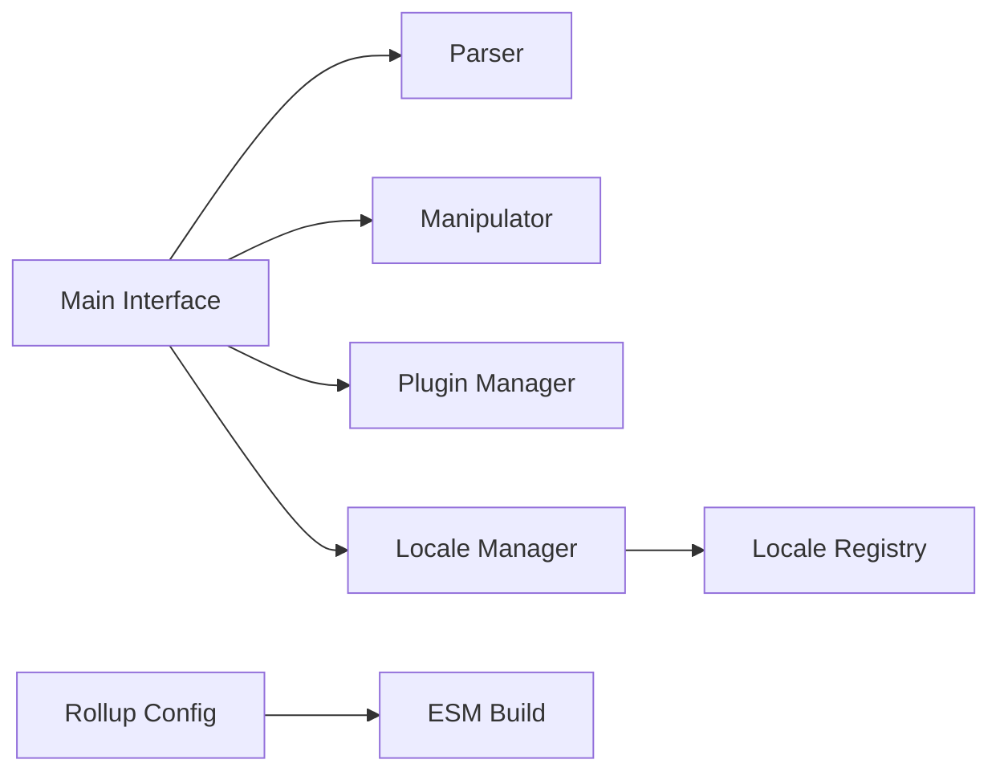

# iamkun/dayjs

> Bibliothèque JavaScript minimaliste de dates, à l'API proche de Moment.js, pour navigateurs modernes.

## Le problème
Manipuler dates et fuseaux en JavaScript brut est pénible, et Moment.js est lourd.

## Ce que ça fait vraiment
Elle parse, valide, manipule et formate des dates avec une API chaînable et immuable, par exemple `dayjs().add(1, 'year')`. Les locales et les plugins (advancedFormat, timezone, utc, duration…) se chargent à la demande et ne sont pas inclus dans le build sans import. Le README annonce environ 2 ko.

## Comment c'est branché

Le texte d'architecture est un guide de dessin, les modules y sont déduits.

## Essayer
```bash
npm install dayjs --save
```

## Coût et pièges
Gratuit. Les plugins et locales doivent être importés explicitement ; sinon les fonctions correspondantes manquent. 1 329 issues ouvertes.

## Ce que ce n'est pas
Ce n'est pas une copie complète de Moment.js : seule l'API principale est compatible, le reste passe par des plugins. Il ne couvre pas Python ni les dates côté données.

## Alternatives
- moment/moment : à garder seulement pour du code existant, il est en mode maintenance.

## Pour toi
À adopter si tu écris du JavaScript (tableaux de bord MLOps) : remplace Moment avec le même style et un poids réduit.

