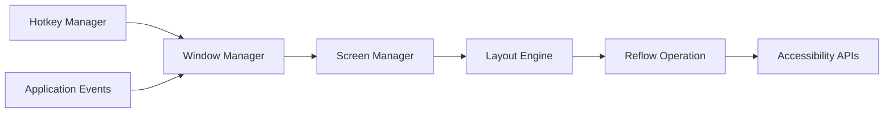

# ianyh/Amethyst

> Gestionnaire de fenêtres en mosaïque pour macOS, dans l'esprit de xmonad, pour utilisateurs de raccourcis clavier.

## Le problème
Sous macOS, ranger et redimensionner des fenêtres se fait à la souris, ce qui coûte du temps.

## Ce que ça fait vraiment
Il organise automatiquement les fenêtres selon des dispositions (Tall, Wide, Column, Row, Fullscreen, BSP, trois colonnes, Floating, personnalisées en JavaScript, beta), pilotées au clavier avec deux combinaisons de modificateurs configurables. Configuration par YAML dans le dossier personnel, qui prime sur l'interface. Il repose sur les API d'accessibilité de macOS.

## Comment c'est branché


## Essayer
```bash
brew install --cask amethyst
defaults write com.apple.dock workspaces-auto-swoosh -bool NO
killall Dock
```

## Coût et pièges
macOS 10.15+, autorisation d'accessibilité obligatoire. Il faut désactiver le réarrangement automatique des Spaces. 294 issues ouvertes.

## Ce que ce n'est pas
Ce n'est pas un gestionnaire pour Windows ou Linux. Ce n'est pas un outil de développement.

## Alternatives
xmonad est cité comme source d'inspiration ; aucune autre alternative nommée.

## Pour toi
À ignorer côté veille métier : confort personnel sous macOS, sans rapport avec la data, l'IA ou le MLOps.

