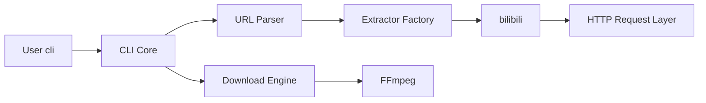

# iawia002/lux

> Téléchargeur de vidéos en ligne de commande écrit en Go, multi-sites.

## Le problème
Récupérer une vidéo ou une playlist depuis YouTube, Bilibili et autres sites demande un outil par plateforme.

## Ce que ça fait vraiment
Un extracteur par site derrière une interface commune ; parseur d'URL qui choisit l'extracteur.
Téléchargement multi-thread, reprise, retry, cookies, proxy, playlists, sous-titres, sortie JSON (`-j`).
Fusion des fragments via FFmpeg ; téléchargement possible via aria2 RPC.

## Comment c'est branché


## Essayer
```bash
go install github.com/iawia002/lux@latest
brew install lux
lux -i "https://www.youtube.com/watch?v=dQw4w9WgXcQ"
```

## Coût et pièges
FFmpeg requis pour fusionner. Certains sites (Youku, Xigua) cassent souvent et exigent des cookies à jour.

## Ce que ce n'est pas
Pas une bibliothèque de dataset vidéo ; couverture centrée sur les sites chinois.

## Alternatives
- youtube-dl : couverture de sites plus large.
- you-get : autre téléchargeur multi-sites.
- ytdl : cité comme projet similaire.

## Pour toi
Hors périmètre ; pour collecter des vidéos, un outil plus large existe.
