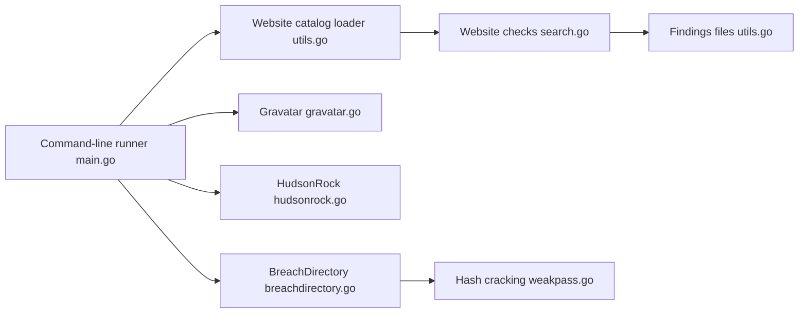

# ibnaleem/gosearch

> Outil OSINT en Go qui cherche un pseudonyme sur de nombreux sites et dans des bases de fuites.

## Le problème
Vérifier à la main si un pseudonyme existe sur des centaines de sites est long, et l'outil de référence (Sherlock) donne des faux positifs et négatifs selon l'auteur.

## Ce que ça fait vraiment
Le binaire lit un catalogue de sites, teste les profils en concurrence, puis enrichit : GitHub, Gravatar, Keybase, domaines sous des TLD courants. Il interroge aussi les API de fuites HudsonRock, ProxyNova et, avec une clé, BreachDirectory ; les empreintes de mots de passe trouvées sont soumises à Weakpass. Les résultats incertains sont colorés en jaune ; `--no-false-positives` ne garde que les profils sûrs. Les résultats sont enregistrés dans des fichiers.

## Comment c'est branché


## Essayer
```bash
go install github.com/ibnaleem/gosearch@latest
gosearch -u [username]
gosearch -u [USERNAME] --no-false-positives
gosearch -u [USERNAME] -b [API-KEY] --no-false-positives
```

## Coût et pièges
Gratuit, mais BreachDirectory demande une clé d'API. Dépend d'API tierces. Windows Defender peut signaler le binaire à tort (issue citée) ; sur 32 bits, utiliser la branche indiquée. Ne télécharger que depuis ce dépôt.

## Ce que ce n'est pas
Ni un outil de conformité ni un service de surveillance : il agrège des données personnelles et des fuites, donc soumis au RGPD et à la législation locale. Usage légitime : enquête autorisée, audit de sa propre exposition. Le README annonce un taux de réussite du craquage « proche de 100 % », affirmation non vérifiée ici.

## Alternatives
- Sherlock : référence citée, en Python, comparée défavorablement par l'auteur.
- urbanadventurer/username-anarchy : génère des pseudonymes à tester, complément plutôt qu'alternative.

## Pour toi
Surveiller : sans mission OSINT encadrée juridiquement, il n'apporte rien à un profil data/IA/MLOps, et il manipule des données sensibles.

