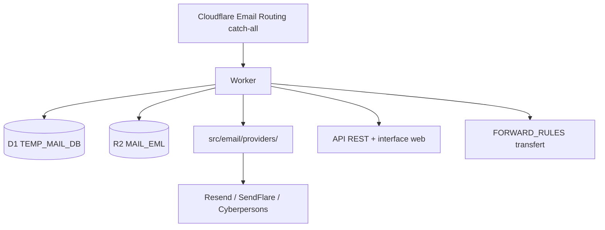

# idinging/freemail

> Service de boîtes mail temporaires auto-hébergé sur Cloudflare Workers, avec API REST et envoi multi-canal.

## Le problème
Créer des adresses jetables pour des inscriptions ou des tests impose de passer par un service tiers opaque.
Récupérer un code de vérification à la main dans une interface publique est lent et peu scriptable.

## Ce que ça fait vraiment
Génère des boîtes temporaires sur un ou plusieurs domaines, reçoit les mails via Cloudflare Email Routing, les stocke en D1 et R2.
Extrait automatiquement les codes de vérification, affiche HTML et texte brut, gère le transfert selon des règles de préfixe.
L'envoi passe par trois canaux (Resend, SendFlare, Cyberpersons) routés par domaine d'expéditeur, abstraits dans `src/email/providers/`.
Back-office d'administration avec comptes utilisateurs, JWT et mot de passe admin.

## Comment c'est branché


## Essayer
```bash
npm install
npx wrangler d1 execute maill_free_db --local --file=./d1-init.sql
npx wrangler dev
```

## Coût et pièges
D1 et R2 ont des quotas gratuits limités : le README recommande de purger les mails anciens régulièrement.
La réception réelle n'est testable qu'une fois déployé sur Cloudflare ; les adresses de transfert doivent être vérifiées dans la console.

## Ce que ce n'est pas
Pas un serveur mail : tout repose sur Cloudflare Email Routing, sans lui rien n'arrive.
Pas prêt tel quel en production : `ADMIN_PASSWORD` et `JWT_TOKEN` par défaut doivent être changés, et une faille d'élévation de privilèges a déjà été corrigée par un contributeur.
SendFlare et Cyberpersons ne gèrent ni la requête d'envoi, ni la modification de `scheduled_at`, ni l'annulation.

## Alternatives
Aucune alternative nommée dans le README.

## Pour toi
Hors sujet pour un profil data / IA / MLOps, sauf à vouloir un banc d'essai de comptes jetables.
