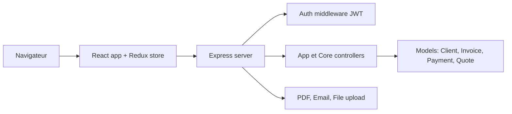

# idurar/idurar-erp-crm

> ERP/CRM open source de facturation, devis et paiements, bâti sur la pile MERN.

## Le problème
Une petite structure veut gérer clients, devis, factures et paiements sans acheter un ERP commercial.

## Ce que ça fait vraiment
Application React (Ant Design, Redux) devant un serveur Express avec MongoDB. Modules cités : clients, devis, factures, paiements, tableau de bord, réglages. L'architecture décrite d'après le code ajoute authentification JWT, génération de PDF, e-mail et envoi de fichiers. Une offre cloud « entreprise » est renvoyée vers cloud.idurarapp.com.

## Comment c'est branché

## Essayer
Le README énumère neuf étapes sans donner de commande : cloner, créer un compte et un cluster MongoDB, éditer le fichier d'environnement, mettre à jour l'URI MongoDB, installer les dépendances back, lancer le script de setup, lancer le back, installer et lancer le front.

## Coût et pièges
Gratuit, mais il faut un compte MongoDB. 483 issues ouvertes. Le README parle d'usage commercial libre et de « fair-code » alors que la licence identifiée est AGPL-3.0 : à vérifier avant tout usage commercial.

## Ce que ce n'est pas
Ce n'est pas un ERP complet : les fonctions listées sont facturation, devis, paiements, clients. Les mentions d'inventaire et de RH ne sont pas détaillées.

## Alternatives
Aucune alternative nommée dans le README.

## Pour toi
Ignorer : application de gestion sans lien avec la donnée ou l'IA, sous AGPL-3.0 avec un discours de licence ambigu.

