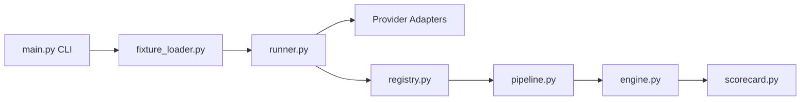

# ifixai-ai/iFixAi

> Audite un agent IA par inspections adverses et notées, avec un juge indépendant, pour équipes IA.

## Le problème
Les évaluations classiques mesurent latence ou injections, pas si l'agent fait son travail dans le cadre métier et organisationnel prévu.

## Ce que ça fait vraiment
Un CLI (ou plugin Claude Code/Codex, ou skill générée) charge une fixture, appelle le modèle ou l'endpoint HTTP de ton agent, fait juger les réponses par un second fournisseur, puis note 60 inspections (note A–F sur cinq piliers, 28 inspections « premium » hors note). Rapports JSON + Markdown. Une version Pro payante existe (service d'audit).

## Comment c'est branché


## Essayer
```bash
pip install "ifixai[openai]"
ifixai setup
ifixai run
ifixai run --provider mock --api-key not-used --eval-mode self
```

## Coût et pièges
Deux clés de fournisseurs différents pour une note citable ; run complet estimé 10–18 $ de juge, agent testé facturé à part. Télémétrie pseudonyme activée (désactivable : `--no-telemetry`). La fixture par défaut contient des défauts volontaires.

## Ce que ce n'est pas
Pas un benchmark de capacités du modèle ni un audit réglementaire : l'audit complet (400 inspections) est le service Pro payant.

## Alternatives
Aucune alternative nommée dans le README.

## Pour toi
Intéressant pour évaluer un agent en production avec un juge croisé, mais jeune (créé en avril 2026) : surveille avant d'en faire une gate de CI.

