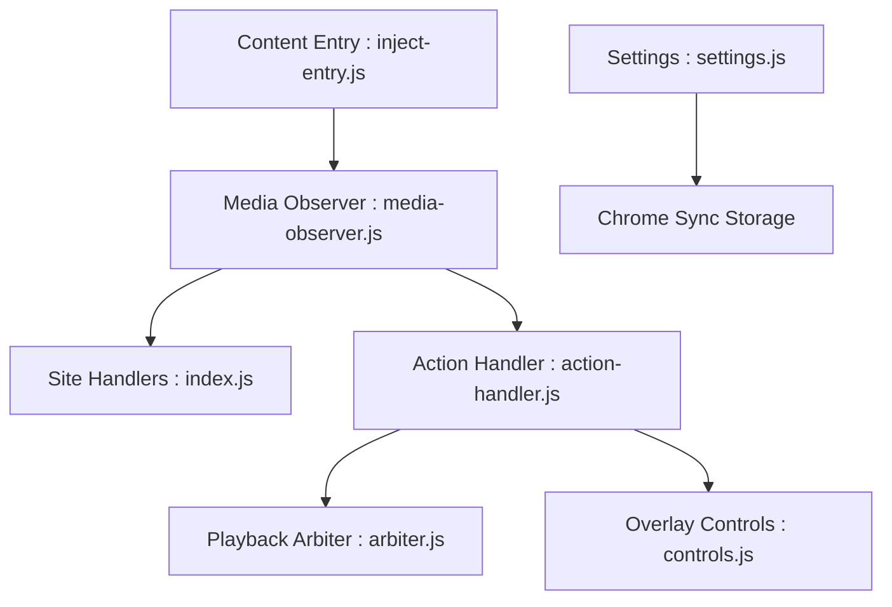

# igrigorik/videospeed

> Extension de navigateur pour régler finement la vitesse de lecture de toute vidéo ou audio HTML5.

## Le problème
Les lecteurs web cachent ou limitent le réglage de vitesse de lecture.

## Ce que ça fait vraiment
Détecte les éléments média, attache un contrôleur superposé et des raccourcis clavier (S, D, R, Z, X, G, V, M, J). Vitesse de 0,07x à 16x, règles par site, désactivation par site, mémorisation de la vitesse, reprise de la vitesse si le site la réinitialise, CSS personnalisable. Gestionnaires spécifiques pour YouTube et Netflix.

## Comment c'est branché


## Essayer
```bash
# Aucune commande : installation depuis le Chrome Web Store (lien en tête du README).
```

## Coût et pièges
Gratuit. Réglages synchronisés via le stockage Chrome. Il faut recharger la page après un changement de raccourcis.

## Ce que ce n'est pas
Pas un outil de transcription ou de résumé : il ne change que la vitesse. Le README justifie l'écoute accélérée par des études, sans les évaluer ici.

## Alternatives
Aucune alternative nommée dans le README.

## Pour toi
À surveiller : gain de temps réel pour regarder cours et conférences ML en accéléré, sans aucun impact sur ton code.

