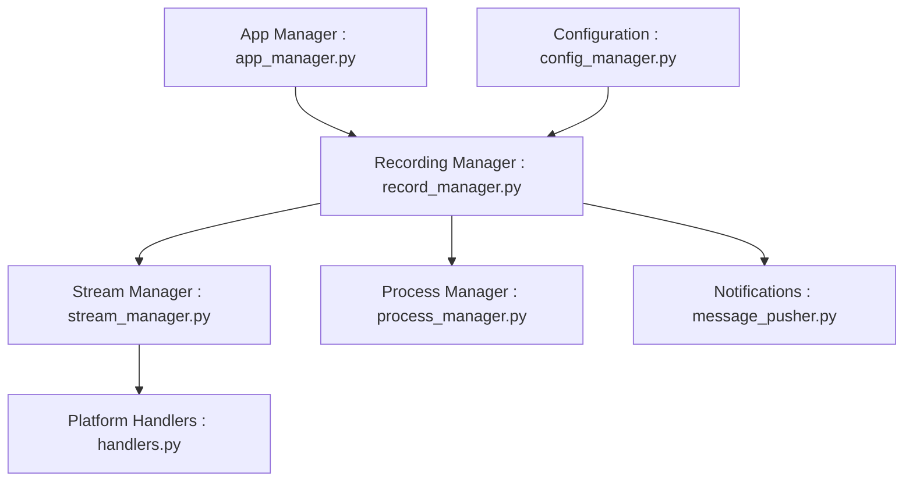

# ihmily/StreamCap

> Client d'enregistrement de flux de diffusion en direct, pour plus de 40 plateformes, basé sur FFmpeg.

## Le problème
Enregistrer automatiquement des diffusions en direct dès leur début.

## Ce que ça fait vraiment
Surveille en boucle ou à horaires fixes l'état des salons, démarre l'enregistrement quand le direct commence (batch possible), écrit en ts, flv, mkv, mp4, mp3 ou m4a, transcode en mp4, envoie des notifications. Utilise la bibliothèque streamget et l'interface Flet. Windows, macOS, mode web.

## Comment c'est branché


## Essayer
```bash
git clone https://github.com/ihmily/StreamCap.git
cd StreamCap
pip install -i https://pypi.org/simple streamget
pip install -r requirements.txt
cp .env.example .env
python main.py
docker compose up
```

## Coût et pièges
Gratuit. Python 3.10+ et FFmpeg requis. YouTube demande un cookie. 236 issues ouvertes. Le droit d'enregistrer dépend de chaque plateforme et du contenu.

## Ce que ce n'est pas
Pas un outil d'analyse de vidéos : il enregistre seulement. README en chinois, sections d'aide dans un wiki externe.

## Alternatives
Aucune alternative nommée dans le README (il remercie flet, FFmpeg, streamget).

## Pour toi
À ignorer : utile pour archiver des directs, mais sans rapport direct avec data/IA ; cadre légal à vérifier.

