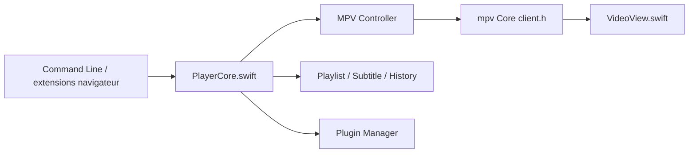

# iina/iina

> Lecteur vidéo et musique moderne pour macOS 11+, construit sur mpv, pour les utilisateurs de Mac.

## Le problème
Les lecteurs macOS natifs lisent peu de formats, et mpv, très capable, n'offre pas d'interface conforme aux usages du Mac.

## Ce que ça fait vraiment
IINA habille le moteur mpv d'une interface macOS : sous-titres (recherche en ligne et appariement local), playlists, chapitres, mode musique, picture-in-picture, Touch Bar, historique. Les fichiers de configuration et scripts mpv restent utilisables, et un système de plugins JavaScript s'ajoute. Une ligne de commande et des extensions Safari et Chrome envoient une URL de média au lecteur.

## Comment c'est branché


## Essayer
```bash
./other/download_libs.sh
mkdir -p deps/executable
ln -s $(which yt-dlp) deps/executable/youtube-dl
```

## Coût et pièges
Gratuit. Compiler exige la dernière version publique de Xcode, sans quoi le build peut échouer. Les builds nightly sont produits à chaque commit et peuvent être inutilisables.

## Ce que ce n'est pas
Ni multiplateforme ni un outil de traitement vidéo : c'est un lecteur pour macOS uniquement. Il ne remplace pas mpv, qu'il embarque.

## Alternatives
- mpv : le moteur lui-même, en ligne de commande, sans interface Mac dédiée.

## Pour toi
Ignorer : un lecteur macOS n'entre pas dans un flux data/IA/MLOps, et sa licence GPL-3.0 compte seulement si tu rediffuses du code dérivé.

