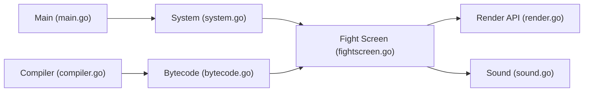

# ikemen-engine/Ikemen-GO

> Moteur de jeu de combat open source en Go, compatible avec les ressources M.U.G.E.N.

## Le problème
M.U.G.E.N est fermé et vieillissant ; les créateurs de personnages et de décors veulent un moteur maintenu et extensible.

## Ce que ça fait vraiment
Interprète des contenus de jeu (`.cmd`, `.air`, `.cns`, `.zss`) compilés en bytecode, avec simulation déterministe, rollback et jeu en ligne. Rendu OpenGL 3.3, OpenGL ES 3.2 ou Vulkan, audio SDL, vidéo FFmpeg, interface en scripts Lua. Vise la compatibilité avec M.U.G.E.N 1.1 Beta sans copier ses bogues. Windows, macOS (Apple Silicon), Linux, Android. Le README dit que le moteur est sous MIT, mais GitHub n'identifie pas le fichier : à vérifier.

## Comment c'est branché


## Essayer
```bash
# Windows : double-cliquer Ikemen_GO.exe
# macOS / Linux : double-cliquer Ikemen_GO.command
```
Pour compiler, le README renvoie à BUILDING.md.

## Coût et pièges
Gratuit ; GPU compatible OpenGL 3.3, GLES 3.2 ou Vulkan. Plus de support de Windows 7/8 ni de macOS Intel. Le motif par défaut est sous CC-BY 3.

## Ce que ce n'est pas
Pas un jeu prêt à jouer : il faut des personnages et décors fournis par la communauté.

## Alternatives
Aucune alternative nommée (M.U.G.E.N est le moteur émulé, et le dépôt d'origine d'Ikemen est cité).

## Pour toi
À ignorer : moteur de jeu de combat sans rapport avec la donnée, l'IA ou le MLOps.

