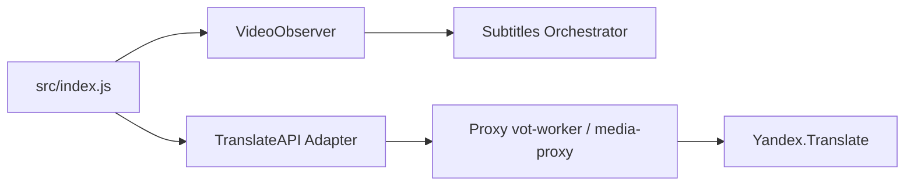

# ilyhalight/voice-over-translation

> Extension de navigateur qui traduit à la voix les vidéos en ligne, avec sous-titres.

## Le problème
Suivre une vidéo dans une langue étrangère sans doublage ni sous-titres fiables.

## Ce que ça fait vraiment
Injecte une traduction audio (russe, anglais, kazakh), des sous-titres enregistrables en `.srt`, `.vtt`, `.json`, l'audio en `.mp3`, et des curseurs de volume séparés. S'installe en userscript (Tampermonkey) ou en extension Chrome/Firefox. Repose sur le service de traduction de Yandex, avec des proxys tiers.

## Comment c'est branché


## Essayer
```bash
npm install
bun run autobuild
npm run build:gm
npm run build:ext
```

## Coût et pièges
Gratuit ; dépend d'API Yandex et de proxys, dont l'un ne fonctionne pas en Russie selon le README. Vidéos de plus de 4 heures non prises en charge. README principalement en russe.

## Ce que ce n'est pas
Pas un traducteur autonome : sans le service de Yandex, il ne produit rien.

## Alternatives
vot-cli et vot.js, cités dans le README.

## Pour toi
Ignorer : dépendance à un service tiers et à un contexte russophone, sans intérêt data/IA/MLOps.

