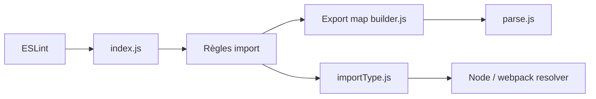

# import-js/eslint-plugin-import

> Plugin ESLint qui vérifie les imports et exports ES2015+ et les chemins de modules.

## Le problème
Les fautes de chemin, d'import nommé ou de cycles de dépendances ne sont vues qu'à l'exécution.

## Ce que ça fait vraiment
Fournit des règles : `no-unresolved`, `named`, `default`, `namespace`, `no-cycle`, `order`, `no-unused-modules`, etc. Il construit une carte des exports de chaque module (analyse en cache) et résout les chemins via des résolveurs (Node, webpack, TypeScript). Compatible configuration historique `.eslintrc` et plate `eslint.config.js`.

## Comment c'est branché


## Essayer
```bash
npm install eslint-plugin-import --save-dev
```

## Coût et pièges
Gratuit. Toutes les règles sont désactivées par défaut. Pour TypeScript, installer `@typescript-eslint/parser` et `eslint-import-resolver-typescript`. 581 issues ouvertes.

## Ce que ce n'est pas
Pas un bundler ni un formateur. Il ne vérifie pas le typage. Le support Sublime a des particularités documentées.

## Alternatives
Aucune alternative nommée dans le README.

## Pour toi
Ignorer : outil de lint JavaScript sans lien avec data/IA ; pertinent seulement si tu maintiens un front en JS/TS.

