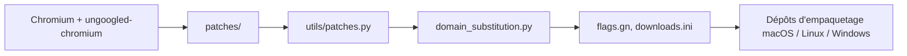

# imputnet/helium

> Navigateur basé sur Chromium, orienté vie privée, avec bloqueur de publicité intégré.

## Le problème
Les navigateurs Chromium classiques embarquent du suivi et du superflu ; les rendre sobres suppose de maintenir des patchs.

## Ce que ça fait vraiment
Le dépôt est surtout un pipeline de patchs au-dessus d'ungoogled-chromium : séries de patchs (noyau, extra, propres à Helium, correctifs amont), scripts Python (`utils/`), substitution de domaines, élagage de binaires, génération de ressources et configuration GN/Ninja. Il intègre des patchs d'Inox, Debian, Bromite, Iridium et Brave. L'empaquetage se fait dans trois dépôts séparés (macOS, Linux, Windows). Il inclut une version modifiée de uBlock Origin.

## Comment c'est branché

## Essayer
Aucune commande documentée : téléchargement depuis helium.computer ou les releases GitHub ; les instructions de développement sont dans le dépôt macOS.

## Coût et pièges
Gratuit. Statut « bêta » : des problèmes sont annoncés possibles. Licence GPL-3.0 (copyleft) ; le code Chromium reste sous BSD-3-Clause.

## Ce que ce n'est pas
Ce n'est pas un outil de scraping ni d'automatisation. Reconstruire le navigateur exige la chaîne complète de Chromium.

## Alternatives
Aucune alternative citée dans le README (ungoogled-chromium est la base du projet).

## Pour toi
Ignorer : un navigateur de plus sans rapport avec le travail data / IA ; choix personnel de vie privée.

