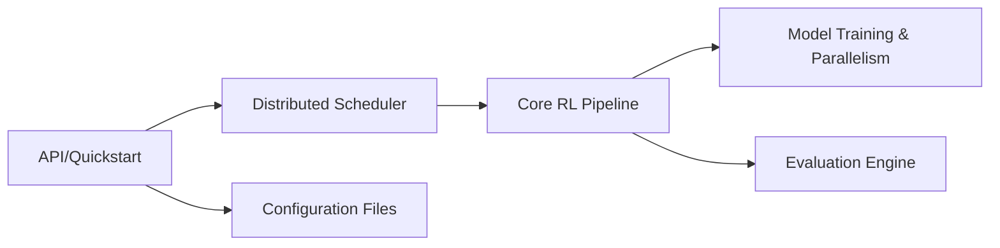

# inclusionAI/AReaL

> Infrastructure d'apprentissage par renforcement asynchrone pour entraîner modèles de raisonnement et agents, pour équipes ML avec GPU.

## Le problème
Entraîner un LLM par RL à grande échelle bloque quand la génération et l'entraînement s'attendent l'un l'autre.

## Ce que ça fait vraiment
Un entraînement RL asynchrone (GRPO, PPO, DAPO, GSPO, etc.) avec backends Megatron, FSDP ou Archon et inférence SGLang ou vLLM. Des exemples : maths, agents de code, recherche, VLM, RLHF. Un agent externe s'entraîne en changeant le `base_url`.

## Comment c'est branché


## Essayer
```bash
git clone https://github.com/areal-project/AReaL
cd AReaL
pip install uv
uv sync --extra cuda
python3 examples/math/gsm8k_rl.py --config examples/math/gsm8k_grpo.yaml scheduler.type=local
```

## Coût et pièges
GPU CUDA indispensable, roue flash-attn à choisir selon Python, cluster Ray pour le multi-nœud. Le diagramme fourni décrit un ancien arbre (`realhf`) : ne pas s'y fier.

## Ce que ce n'est pas
Pas une bibliothèque de fine-tuning simple. La licence n'est pas déclarée dans le catalogue.

## Alternatives
Le README cite VeRL, OpenRLHF et DeepScaleR comme projets dont il s'inspire.

## Pour toi
À surveiller : pertinent seulement si tu entraînes des modèles par RL sur des GPU ; sinon c'est trop lourd.
