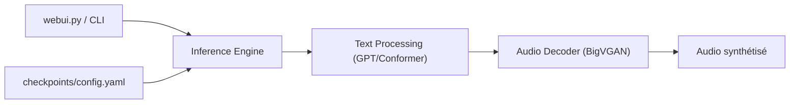

# index-tts/index-tts

> Synthèse vocale zero-shot qui clone une voix depuis un seul extrait, avec contrôle d'émotion et de prononciation.

## Le problème
Cloner une voix et piloter émotion, vitesse et prononciation demande souvent plusieurs modèles ou des données d'entraînement.

## Ce que ça fait vraiment
IndexTTS-2.5 (chinois, anglais, japonais, espagnol, arabe) clone une voix à partir d'un audio de référence. Contrôle de l'émotion par audio, vecteur de 8 valeurs ou texte, de la durée (`duration_factor`) et de la prononciation (Pinyin, phonèmes CMU, Kana). Le README publie des tableaux WER/similarité et un facteur temps réel de 0,2 sur RTX 4090. Interface web, API Python et recette vLLM.

## Comment c'est branché


## Essayer
```bash
git clone https://github.com/index-tts/index-tts.git && cd index-tts
uv sync --all-extras
hf download IndexTeam/IndexTTS-2.5 --local-dir=checkpoints
uv run webui.py
```

## Coût et pièges
GPU NVIDIA (CUDA 12.8+) conseillé. Téléchargement de modèles depuis Hugging Face ou ModelScope. Licence présente mais non identifiée par GitHub : à lire avant tout usage commercial.

## Ce que ce n'est pas
Ce n'est pas un service hébergé prêt à l'emploi. Le clonage de voix soulève des questions de consentement que le README ne traite pas.

## Alternatives
Aucune alternative nommée dans le README (le tableau compare VoxCPM2, OmniVoice, CosyVoice3, Fish Audio S2 Pro, Qwen3-TTS…).

## Pour toi
Surveiller : intéressant pour prototyper de la TTS multilingue en local, mais licence à clarifier et GPU nécessaire.

