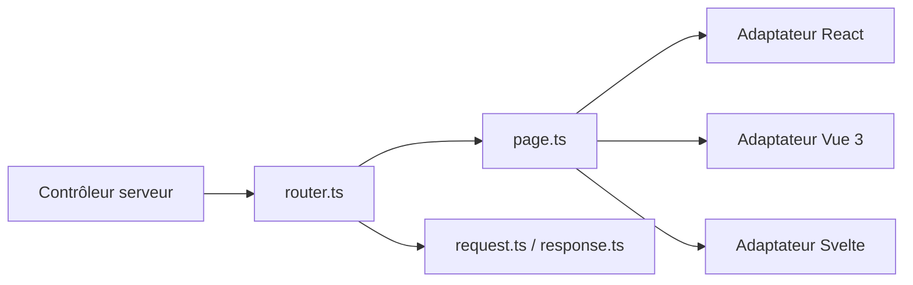

# inertiajs/inertia

> Colle un backend (Laravel, Rails…) à un front React, Vue ou Svelte sans écrire d'API.

## Le problème
Bâtir une SPA oblige d'ordinaire à construire une API et à dupliquer routage et validation côté client.

## Ce que ça fait vraiment
Le contrôleur serveur renvoie un composant de page avec ses données ; Inertia gère la navigation sans rechargement complet. Formulaires, envois de fichiers, rechargements partiels, préchargement, rendu serveur et DevTools sont inclus. Adaptateurs React/Vue/Svelte dans ce dépôt ; Laravel officiel, autres serveurs par la communauté.

## Comment c'est branché


## Essayer
```bash
# Pas de commande d'installation dans le README ; voir la documentation officielle
```

## Coût et pièges
Gratuit. Le README pousse Laravel Cloud (Starter à 5 $/mois) pour le déploiement : optionnel.

## Ce que ce n'est pas
Ni un framework complet ni un remplacement de React/Vue : il faut un backend compatible. Pas un outil pour notebooks ou pipelines.

## Alternatives
Aucune alternative nommée dans le README.

## Pour toi
Ignorer : utile pour du web full-stack, hors du périmètre data/IA/MLOps.

