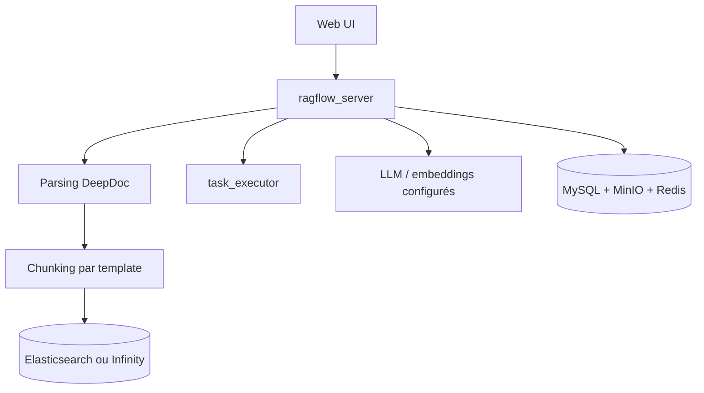

# infiniflow/ragflow

> Moteur RAG auto-hébergé fondé sur la compréhension profonde de documents, avec capacités d'agent.

## Le problème
Un RAG naïf découpe les documents à l'aveugle et rend des extraits incohérents sur des PDF complexes.
Monter une chaîne complète (parsing, chunking, index, rerank, orchestration) prend des semaines.

## Ce que ça fait vraiment
Découpage par templates, décrit comme explicable et paramétrable selon le type de document.
Accepte Word, slides, Excel, TXT, images, copies scannées, données structurées et pages web.
Rappel multiple avec reranking fusionné ; LLM et modèles d'embedding configurables.
Moteur documentaire commutable entre Elasticsearch (défaut) et Infinity via `DOC_ENGINE`.

## Comment c'est branché


## Essayer
```bash
git clone https://github.com/infiniflow/ragflow.git
cd ragflow/docker && git checkout v0.27.2
docker compose -f docker-compose.yml up -d
docker logs -f docker-ragflow-cpu-1
```

## Coût et pièges
Le logiciel est gratuit ; les clés LLM sont à ta charge et un service cloud payant existe.
Exige 4 cœurs, 16 Go de RAM, 50 Go de disque, `vm.max_map_count ≥ 262144`, et gVisor pour le sandbox de code.

## Ce que ce n'est pas
Pas léger : la pile complète réclame MySQL, MinIO, Redis et Elasticsearch en plus du service.
Les images Docker sont x86 uniquement — sur ARM64 il faut reconstruire soi-même.
Le passage à Infinity efface les volumes existants et n'est pas supporté officiellement sur Linux/arm64.

## Alternatives
- `microsoft/markitdown` : si seule la conversion en Markdown est nécessaire.
- `PaddlePaddle/PaddleOCR` : la brique de parsing documentaire, sans le moteur RAG autour.

## Pour toi
La solution RAG clé en main la plus complète du lot, mais lourde. À évaluer contre une chaîne maison.
