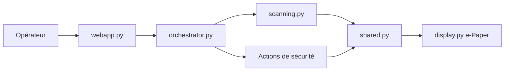

# infinition/Bjorn

> Outil de reconnaissance réseau autonome pour Raspberry Pi avec écran e-Paper, pour équipes de sécurité autorisées.

## Le problème
Auditer régulièrement un réseau que l'on administre suppose du matériel dédié et des scripts épars. Bjorn les regroupe dans un petit boîtier autonome.

## Ce que ça fait vraiment
Un orchestrateur (`orchestrator.py`) enchaîne des actions configurables : découverte d'hôtes et de ports (`scanning.py`), évaluation de vulnérabilités, tests d'identifiants sur des services, puis collecte de données. Chaque action enfant dépend du succès de l'action parente. L'état est partagé (`shared.py`) et affiché sur l'écran e-Paper (`display.py`) et via une interface web (`webapp.py`). Le README annonce des modules ajoutables par la communauté. Les résultats sont rangés dans `data/output/`.

## Comment c'est branché


## Essayer
```bash
wget https://raw.githubusercontent.com/infinition/Bjorn/refs/heads/main/install_bjorn.sh
sudo chmod +x install_bjorn.sh && sudo ./install_bjorn.sh
```
Prérequis du README : Raspberry Pi OS (Debian 12 bookworm), utilisateur et hostname `bjorn`, écran e-Paper 2,13 pouces (versions V2 et V4 testées).

## Coût et pièges
Gratuit, mais il faut un Raspberry Pi Zero W/W2 et l'écran. L'installation est longue et impose un redémarrage. L'usage n'est licite que sur des réseaux dont on est propriétaire ou pour lesquels on a une autorisation écrite : le README lui-même précise « éducatif et tests autorisés uniquement ».

## Ce que ce n'est pas
Ce n'est pas un outil de supervision passive : il agit sur le réseau (tests d'authentification, collecte). La démo du README est déclarée fictive. Le support du Pi Zero W2 64 bits repose sur des retours d'utilisateurs, pas sur un développement dédié.

## Alternatives
- infinition/bjorn-detector : mentionné par le README pour retrouver l'IP du boîtier après installation (compagnon, pas un substitut).

## Pour toi
Surveiller : projet de bricolage sécurité, sans lien avec un flux data/IA/MLOps ; à ne considérer que pour un laboratoire réseau personnel encadré.

