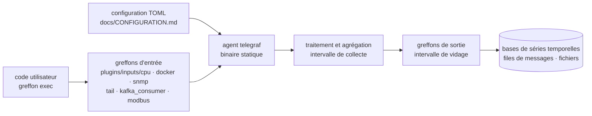

# influxdata/telegraf

> **A single TOML-configured agent that collects metrics and logs and writes them somewhere else.**

## The problem

Without a generic agent, every data source needs its own collector: one exporter for Windows
performance counters, another for Modbus, a hand-written script to tail a log file, a third
one to query a SQL database. Each has its own install path, its own configuration format, its
own failure modes. The collection fleet ends up harder to maintain than what it observes.

## What it actually does

Telegraf is an agent that *collects, processes, aggregates and writes* metrics, logs and
"other arbitrary data" — that is the README's own definition, and it is deliberately broad.
The mechanism fits in one sentence, also from the README: you write a TOML configuration
listing the plugins and settings you want, you hand it to Telegraf, and the agent pulls from
inputs at each collection interval and pushes to outputs at each flush interval.

What the agent contributes itself is that loop and the configuration format; everything else
comes from plugins — over 300 of them per the README, grouped by topic: industrial devices
(OPC UA, Modbus), logs (File, Tail, Directory Monitor), messaging (AMQP, Kafka, MQTT),
monitoring (OpenTelemetry, Prometheus), networking (Cisco TelemetryMDT, gNMI), system (CPU,
memory, disk, network, SMART, Docker, Nvidia SMI), universal (Exec, HTTP, SNMP, SQL) and
Windows (Event Log, WMI, performance counters). User-defined code can be integrated to
collect, transform and transmit data. The whole thing compiles to a standalone static binary
with no external dependencies.

## How it is wired

No code-derived diagram exists for this repository: the graph above is reconstructed from the
README alone, whose plugin links all point at `plugins/inputs/<name>`. Every plugin carries
its own README under `/plugins`, and that is the real documentation entry point: the core
agent is small, the surface lives in the plugins.

## Trying it

**The README contains no commands at all.** It defers installation to `/docs/INSTALL_GUIDE.md`
(binary builds, Docker images, RPM and DEB packages), first steps to `/docs/QUICK_START.md`,
configuration to `/docs/CONFIGURATION.md` and general documentation to `/docs/README.md`.
Nothing is reconstructed here: read those four files in the repository before installing.

## Cost and traps

- **Free, MIT licensed** per the catalogue entry and the README badge. No API key, no account
  to create for the agent itself.
- **No runtime prerequisites**: the README stresses the standalone static binary with no
  external dependencies. Installation cost is low; the *configuration* cost is the real one,
  and the README shows not a single example of it.
- **The README itself is the trap**: no command, no TOML snippet, no exhaustive plugin list.
  Everything sits behind links into `/docs` and `/plugins`. The setup effort cannot be judged
  without opening the repository — hence the "insufficient material" flag kept here.
- **Dependencies arrive through plugins**, not through the agent: a Docker plugin assumes a
  Docker daemon, a Kafka plugin a broker, a SQL plugin a database. Each plugin has its own
  README, to be read one by one.
- **Versioning and release cadence** are documented separately (`/docs/RELEASES.md`), which
  suggests a cycle worth knowing before pinning a version.

## What it is not

- **Not a database or a store.** Telegraf writes to outputs; it keeps nothing. Storage and
  querying remain a separate choice to make and operate alongside.
- **Not a visualisation or alerting tool**: no dashboards, no threshold rules in the scope the
  README describes.
- **Not an InfluxDB-only agent**, despite the vendor: the README presents generic plugins and
  cites OpenTelemetry and Prometheus on the same footing as the rest. Conversely, it is not an
  independent project either — it is driven by a company whose main product lies elsewhere.
- **Not a Go library to import**: it is an agent you deploy and configure.

## Alternatives

| | When to prefer it |
|---|---|
| **VictoriaMetrics/VictoriaMetrics** | Catalogue neighbour, only partly comparable: where Telegraf stops at collecting and writing, VictoriaMetrics provides storage and querying. Prefer it when the need is to *keep* time series rather than only move them; complementary rather than competing. |
| **kubernetes/kube-state-metrics** | Catalogue neighbour with a far narrower scope: Kubernetes cluster objects and nothing else. Prefer it when Kubernetes is the only source to observe; Telegraf when the sources are heterogeneous (industrial, system, logs, messaging). |

The other suggested neighbours (`PostHog/posthog`, `ongridio/ongrid`) are not comparable: the
first is a product analytics platform built on user events, the second has nothing to do with
infrastructure metric collection.

## For you

Useful as soon as a machine or a fleet must be instrumented without writing a collector: one
binary, one TOML file, and heterogeneous sources (system, Docker, Nvidia SMI, SQL, HTTP, log
files) land in the same pipe — exactly the missing brick when you want GPU usage or model
serving latency measured without standing up a full stack. Skip it if you already live
entirely inside the Prometheus ecosystem with its exporters: the gain then shrinks to the
exotic sources.
