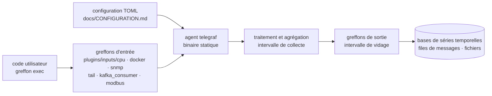

# influxdata/telegraf

> **Un agent unique, configuré en TOML, qui collecte des métriques et des logs et les réémet ailleurs.**

## Le problème

Sans agent générique, chaque source de données exige son propre collecteur : un exportateur
pour les compteurs Windows, un autre pour Modbus, un script maison pour lire un fichier de
log, un troisième pour interroger une base SQL. Chacun a son mode d'installation, son format
de configuration, sa façon d'échouer. Le parc de collecte devient plus dur à maintenir que ce
qu'il observe.

## Ce que ça fait vraiment

Telegraf est un agent qui *collecte, traite, agrège et écrit* des métriques, des logs et
« d'autres données arbitraires » — c'est la définition que donne le README, et elle est
volontairement large. Le mécanisme tient en une phrase, également du README : on écrit une
configuration TOML listant les greffons souhaités et leurs réglages, on la passe à Telegraf,
qui lit les entrées à chaque intervalle de collecte et pousse vers les sorties à chaque
intervalle de vidage.

Ce que l'agent apporte lui-même, c'est cette boucle et le format de configuration ; tout le
reste vient des greffons, plus de 300 selon le README, répartis par thème : appareils
industriels (OPC UA, Modbus), logs (File, Tail, Directory Monitor), messagerie (AMQP, Kafka,
MQTT), supervision (OpenTelemetry, Prometheus), réseau (Cisco TelemetryMDT, gNMI), système
(CPU, mémoire, disque, réseau, SMART, Docker, Nvidia SMI), universels (Exec, HTTP, SNMP, SQL)
et Windows (journal d'événements, WMI, compteurs de performance). Du code défini par
l'utilisateur peut être intégré pour collecter, transformer et transmettre. Le tout compile en
un binaire statique sans dépendance externe.

## Comment c'est branché

Aucun diagramme tiré du code n'existe pour ce dépôt : ce schéma est reconstruit depuis le seul
README, dont les liens de greffons pointent tous vers `plugins/inputs/<nom>`. Chaque greffon a
son propre README sous `/plugins`, ce qui est le vrai point d'entrée de la documentation :
l'agent central est petit, la surface est dans les greffons.

## Essayer

**Le README ne contient aucune commande.** Il renvoie l'installation vers
`/docs/INSTALL_GUIDE.md` (builds binaires, images Docker, paquets RPM et DEB), la prise en
main vers `/docs/QUICK_START.md`, la configuration vers `/docs/CONFIGURATION.md` et la
documentation générale vers `/docs/README.md`. Rien n'est reconstruit ici : ces quatre
fichiers sont à lire dans le dépôt avant toute installation.

## Coût et pièges

- **Gratuit, licence MIT** selon le lot et le badge du README. Pas de clé d'API, pas de compte
  à créer pour l'agent lui-même.
- **Aucun prérequis d'exécution** : le README insiste sur le binaire statique sans dépendance
  externe. Le coût d'installation est donc faible ; c'est le coût de *configuration* qui est
  réel, et le README n'en montre pas un seul exemple.
- **Le vrai piège est le README lui-même** : il ne donne ni commande, ni extrait de TOML, ni
  liste exhaustive des greffons. Tout est derrière des liens vers `/docs` et `/plugins`.
  Impossible d'évaluer l'effort de mise en place sans ouvrir le dépôt — d'où l'alerte
  « matière insuffisante » retenue ici.
- **Les dépendances arrivent par les greffons**, pas par l'agent : un greffon Docker suppose
  un démon Docker, un greffon Kafka un courtier, un greffon SQL une base. Chaque greffon a son
  README, à lire un par un.
- **Versionnement et cadence de publication** sont documentés à part (`/docs/RELEASES.md`), ce
  qui suggère un cycle à connaître avant d'épingler une version.

## Ce que ce n'est pas

- **Ce n'est pas une base de données ni un stockage.** Telegraf écrit vers des sorties ; il ne
  conserve rien. Le système de stockage et de requête reste à choisir et à exploiter à côté.
- **Ce n'est pas un outil de visualisation ni d'alerte** : aucun tableau de bord, aucune règle
  de seuil dans le périmètre décrit par le README.
- **Ce n'est pas un agent InfluxDB uniquement**, malgré l'éditeur : le README ne présente que
  des greffons génériques et cite OpenTelemetry et Prometheus au même titre que le reste.
  Inversement, ce n'est pas un projet indépendant : il est porté par une entreprise dont le
  produit principal est ailleurs.
- **Ce n'est pas une bibliothèque Go à importer** : c'est un agent qu'on déploie et qu'on
  configure.

## Alternatives

| | Quand le préférer |
|---|---|
| **VictoriaMetrics/VictoriaMetrics** | Voisin du catalogue, comparable en partie seulement : là où Telegraf s'arrête à la collecte et à l'écriture, VictoriaMetrics fournit le stockage et la requête. À préférer quand le besoin est de *garder* les séries temporelles, pas seulement de les acheminer ; complémentaire plutôt que concurrent. |
| **kubernetes/kube-state-metrics** | Voisin du catalogue, périmètre bien plus étroit : les objets d'un cluster Kubernetes, rien d'autre. À préférer si la seule source à observer est Kubernetes ; Telegraf si les sources sont hétérogènes (industriel, système, logs, messagerie). |

Les autres voisins proposés (`PostHog/posthog`, `ongridio/ongrid`) ne sont pas comparables :
le premier est une plateforme d'analyse de produit orientée événements utilisateurs, le second
n'a rien à voir avec la collecte de métriques d'infrastructure.

## Pour toi

Utile dès qu'il faut instrumenter une machine ou une flotte sans écrire de collecteur : un
binaire, un fichier TOML, et les sources hétérogènes (système, Docker, Nvidia SMI, SQL, HTTP,
fichiers de log) arrivent dans le même tuyau — c'est exactement la brique manquante quand on
veut mesurer l'usage GPU ou la latence d'un service de modèles sans monter une pile complète.
À passer si l'on vit déjà entièrement dans l'écosystème Prometheus avec ses exportateurs :
l'apport se réduit alors aux sources exotiques.
