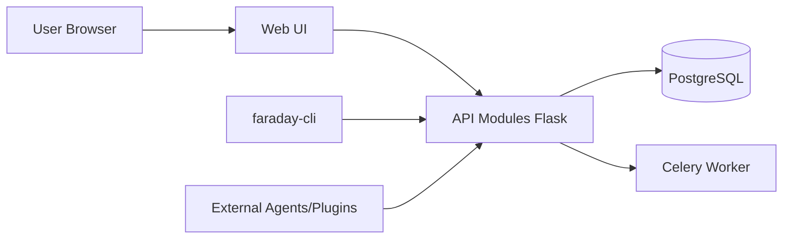

# infobyte/faraday

> Plateforme multi-utilisateur qui centralise et normalise les résultats de scanners de vulnérabilités, pour équipes sécurité.

## Le problème
Les résultats de nombreux outils d'audit sont dispersés dans des formats différents ; le suivi de la remédiation devient difficile à partager.

## Ce que ça fait vraiment
Serveur qui agrège et normalise des résultats venant de plus de 80 outils via des plugins (de type « console » qui interprètent une sortie, ou « report » qui importent XML/JSON). Ils sont stockés dans PostgreSQL et présentés dans une interface web avec visualisations. Un client `faraday-cli` et des agents distants (Agents Dispatcher) permettent d'automatiser et de lancer des outils à distance. L'usage suppose d'être autorisé à auditer les cibles.

## Comment c'est branché


## Essayer
```bash
wget https://raw.githubusercontent.com/infobyte/faraday/master/docker-compose.yaml
docker-compose up
pip3 install faradaysec
faraday-manage initdb
faraday-server
pip3 install faraday-cli
faraday-cli tool report burp.xml
```

## Coût et pièges
Gratuit. Il faut un PostgreSQL (fourni par le compose, sinon à monter). Le mot de passe initial est donné à l'installation, interface sur le port 5985.

## Ce que ce n'est pas
Ce n'est pas un scanner : il organise les résultats d'outils tiers et n'en découvre aucun lui-même. Licence GPL-3.0 (copyleft). Le README ne détaille ni limites ni tarifs d'une éventuelle offre commerciale.

## Alternatives
Aucune alternative nommée dans le README ; il cite des outils qu'il intègre (Nmap, Burp, OWASP ZAP, SonarQube, Bandit).

## Pour toi
À surveiller : utile seulement si ton équipe fait des audits de sécurité réguliers ; hors de ce cadre, un profil data/IA n'en tirera rien.
