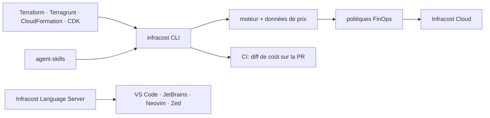

# infracost/infracost

> Estimation de coût cloud et politiques FinOps depuis le terminal, l'éditeur, l'agent IA et la CI.

## Le problème
Le coût d'une modification d'infrastructure n'apparaît qu'à la facture, un mois après la fusion de
la pull request.

## Ce que ça fait vraiment
La CLI analyse un projet Terraform, Terragrunt, CloudFormation ou AWS CDK et renvoie une ventilation
complète des coûts et des recommandations FinOps ; `infracost inspect` détaille les ressources et les
facteurs de coût. `infracost setup` câble en une passe l'authentification, l'éditeur, les skills
d'agent IA et la CI. Trois skills existent pour Claude Code, Cursor et consorts : `iac-generation`
(garder l'IaC généré conforme aux politiques de tags, région et budget), `scan` et `price-lookup`.
Les extensions d'éditeur (VS Code, JetBrains, Neovim, Zed) affichent lentilles de coût, indications
en ligne et diagnostics, toutes portées par l'Infracost Language Server — donc utilisables par tout
éditeur parlant LSP. La CI publie diffs de coût et vérifications de politique sur les PR.

## Comment c'est branché


## Essayer
```sh
brew install infracost
curl -fsSL https://raw.githubusercontent.com/infracost/cli/master/scripts/install.sh | sh
choco install infracost
infracost setup
infracost scan
```

## Coût et pièges
La CLI exige une authentification via `infracost setup`, donc un compte. Les politiques de tags et
les garde-fous se définissent dans Infracost Cloud, le tableau de bord SaaS : c'est lui qui assure la
cohérence entre CLI, éditeurs, skills et CI. L'installation Linux passe par un `curl | sh`.

## Ce que ce n'est pas
Ce n'est pas un outil de facturation réelle : il estime à partir de données de prix et de ton code,
pas de ta consommation observée. Ce dépôt n'est d'ailleurs plus le code — depuis Infracost 2.0, la
base a été éclatée en dépôts dédiés (`infracost/cli`, `infracost/agent-skills`, extensions) ; celui-ci
est la porte d'entrée, pour les issues et les discussions générales.

## Alternatives
Aucune alternative externe n'est nommée ; le README ne liste que les composants du même écosystème.

## Pour toi
Le skill `price-lookup` seul vaut le détour pour chiffrer une instance GPU avant de la provisionner ;
le reste suppose que ton équipe adopte Infracost Cloud.
