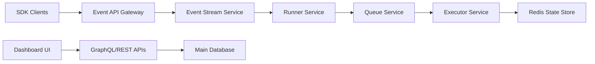

# inngest/inngest

> Plateforme de fonctions durables : jobs, workflows par étapes et planification sans gérer de files.

## Le problème
Les tâches de fond fiables exigent files, état, retries et cron assemblés à la main, avec beaucoup d'infrastructure.

## Ce que ça fait vraiment
Tu écris des fonctions avec un SDK (TypeScript, Python, Go, Kotlin) : déclencheur (événement, cron, webhook), contrôle de flux, étapes.
Chaque `step.run` est rejoué et réessayé indépendamment ; les runs peuvent durer des mois.
Le serveur (Event API, Runner, Queue, Executor, State store) invoque tes fonctions en HTTPS.
Dev server local avec tableau de bord ; auto-hébergement possible.

## Comment c'est branché


## Essayer
```bash
npx inngest-cli@latest dev
```
Puis ouvrir http://localhost:8288.

## Coût et pièges
Serveur libre en auto-hébergement ; la plateforme hébergée est un service commercial. Licence non identifiée par GitHub, à lire avant usage.

## Ce que ce n'est pas
Pas une simple file de messages : il impose son modèle de fonctions à étapes et appelle ton code par HTTP.

## Alternatives
Aucune alternative nommée dans le README.

## Pour toi
À surveiller : sérieux pour orchestrer des pipelines LLM longs et réessayables avec le SDK Python, sous réserve de valider la licence.
