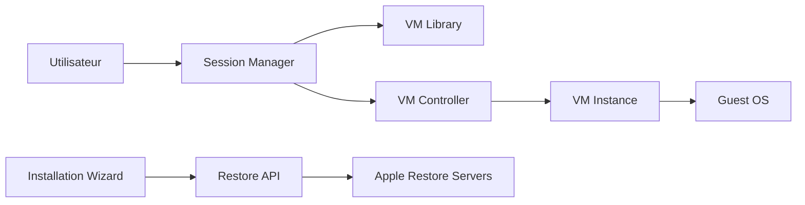

# insidegui/VirtualBuddy

> Virtualise macOS sur Apple Silicon pour tester des applications sur plusieurs versions du système, bêtas comprises.

## Le problème
Tester une application sur plusieurs versions de macOS demande des machines ou des installations multiples.

## Ce que ça fait vraiment
Assistant d'installation qui télécharge une version de macOS depuis les serveurs Apple ou utilise un IPSW local ou une URL. Il gère aussi des distributions Linux ARM (Ubuntu testé), le mode récupération, le réseau, le partage de fichiers et de presse-papiers, et la sauvegarde d'état d'une VM. Une app « invité » assure le presse-papiers et le montage automatique des dossiers partagés. Le clonage APFS permet de dupliquer une VM à faible coût disque.

## Comment c'est branché


## Essayer
À exécuter dans le terminal de la VM, pour monter un dossier partagé :
```bash
mkdir -p ~/Desktop/VirtualBuddyShared && mount -t virtiofs VirtualBuddyShared ~/Desktop/VirtualBuddyShared
```

## Coût et pièges
Gratuit (achat Gumroad ou sponsor facultatif). Apple Silicon, macOS 13+. Pour compiler : Xcode 16 et un bundle ID unique. Les bêtas exigent les device support files d'Apple.

## Ce que ce n'est pas
Ce n'est pas un outil x86 ni un hyperviseur généraliste : il repose sur la virtualisation Apple, sur Mac Apple Silicon uniquement. Le client invité est indisponible avant macOS 13 pour le presse-papiers.

## Alternatives
Aucune alternative nommée dans le README.

## Pour toi
Ignorer : outil de test d'apps Apple, sauf si tu dois isoler des environnements macOS pour des tests de CI ; rien de spécifique data/IA.

