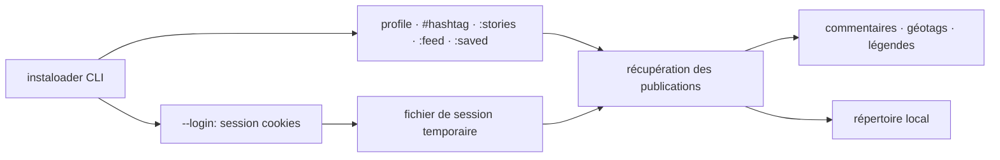

# instaloader/instaloader

> Outil en ligne de commande pour télécharger profils, stories et médias Instagram.

## Le problème
Archiver le contenu public d'un compte Instagram à la main est impraticable, et une interruption
oblige à tout reprendre.

## Ce que ça fait vraiment
Instaloader télécharge profils publics et privés, hashtags, stories, fils et médias enregistrés,
avec les commentaires, géotags et légendes de chaque publication. Il détecte automatiquement les
changements de nom de profil et renomme le répertoire cible en conséquence. Il permet un filtrage
fin et le choix du rangement des médias, et reprend les itérations interrompues. `--fast-update`
s'arrête à la première image déjà téléchargée ; `--latest-stamps` mémorise la date du dernier
téléchargement par profil, ce qui permet de déplacer ou supprimer les médias tout en gardant
l'archive à jour.

## Comment c'est branché


## Essayer
```bash
pip3 install instaloader
instaloader profile [profile ...]
instaloader --fast-update profile [profile ...]
instaloader --latest-stamps -- profile [profile ...]
instaloader --login=your_username profile [profile ...]
```

## Coût et pièges
Gratuit, licence MIT. Les profils privés et les stories exigent un compte Instagram et
`--login` ; les cookies de session sont écrits en clair dans un fichier du répertoire temporaire, à
protéger. L'outil dépend entièrement d'une plateforme tierce qu'il ne contrôle pas.

## Ce que ce n'est pas
Le README est explicite : le projet n'est ni affilié, ni autorisé, ni maintenu, ni approuvé par
Instagram — usage à tes risques. Ce n'est pas une API officielle, ni un outil d'analyse : il
télécharge, il ne traite pas.

## Alternatives
Aucune alternative n'est nommée ; le README mentionne seulement ses sponsors (SocialAPIs,
@rocketapi-io), qui sont des services d'API tierces, pas des remplaçants documentés.

## Pour toi
Utile ponctuellement pour constituer un corpus d'images ou de légendes, en gardant à l'esprit le
statut non officiel et les questions de droits sur les contenus collectés.
